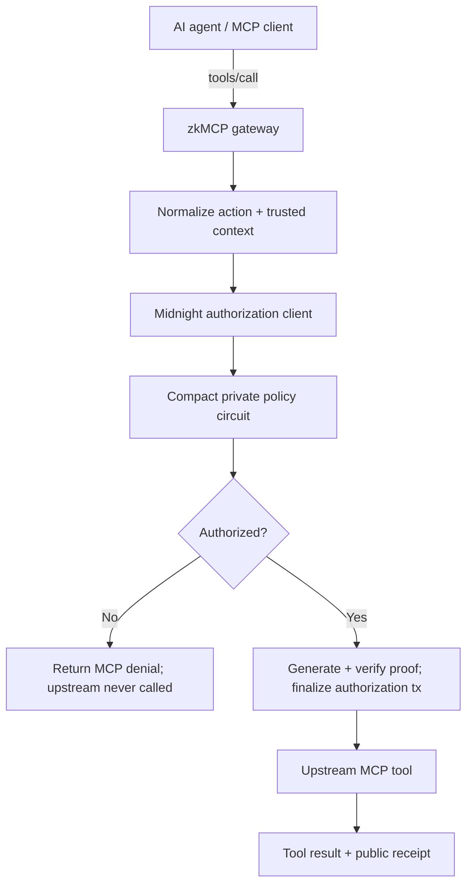

# zkMCP

**Cryptographic authorization for AI agents.**

zkMCP is a zero-knowledge authorization gateway for the Model Context Protocol. It sits between an AI agent and an existing MCP server, proves that a sensitive `tools/call` satisfies a private policy with Midnight/Compact, and invokes the upstream tool **only after** authorization succeeds.

Built for the **Midnight Hackathon — AI Track, August 2026**.

**Live documentation:** https://zkmcp.zohaibarsalan.me



## What is working

The repository contains a real end-to-end MCP + Midnight implementation, not a simulated authorization UI.

- real MCP TypeScript SDK v2 client/server gateway
- `tools/list` proxying from the upstream MCP server
- pre-execution interception of `tools/call`
- private Compact policy committed at contract deployment
- real Midnight proof generation and verification
- finalized authorization transactions before upstream execution
- resource-scoped document authorization
- trusted human-approval boundary outside agent-controlled tool arguments
- private payment maximum and approval threshold
- nullifier-based replay protection
- privacy-safe MCP proof receipts and errors
- typed errors + local evlog observability
- Fumadocs developer documentation and interactive playground
- Scalar OpenAPI reference for the local demo bridge

### Final verification run

The final local verification run on **29 August 2026** passed all eight real MCP scenarios:

```text
ALLOW  assigned matter document           ✅ proof + upstream execution
DENY   unrelated matter document          ✅ blocked before upstream execution
DENY   external email without approval    ✅ blocked before upstream execution
ALLOW  external email with approval       ✅ proof + upstream execution
ALLOW  payment below private threshold    ✅ proof + upstream execution
DENY   payment needs approval             ✅ blocked before upstream execution
ALLOW  payment with human approval        ✅ proof + upstream execution
DENY   payment above private maximum      ✅ blocked before upstream execution

8/8 passed
```

Final local deployment:

```text
network              undeployed
contract             ddbe8f734862392428c7e55194ed00a9ac8d00a99cf41cfe81f27afb345793ac
policy commitment    0x8b701e17a4e1ae066971baa4aaa90bced67eb127a606c73b532589a77e9eaa99
```

Fresh successful authorization transactions from that run:

```text
documents.read       00f3ac51f4a5658ffc3432d62cdae2a15c509769afdfb56e641cca5cfda2e21298
email.send           00f726b838d83ac01ae5df43330dc074de8845e112a9f6d4675414d5f21462b7c4
payments.transfer    00b4a29f85034bd28b8ddb0fe728d99ac511e5c6306506be9a94ac6830c95d05c3
payments + approval  00c3ddd1aca7df1c9fbfec1cac5e13d9c2f82afe2e9ecabe620b7fb19ca7f43192
```

The proof server logged real `/prove` requests followed by `proof created`, verification, and `proof ok` during the same run.

See [Verification evidence](apps/web/content/docs/development/verification.mdx) for the full receipts, block heights, commitments, and reproduction commands.

## The problem

MCP gives an application a standardized way to reach tools. That does not automatically answer whether an autonomous agent has authority for each individual side effect.

```text
Access     Can the application reach the service?
Intent     What action does the model want to take?
Authority  Is this exact action permitted under the user's rules?
```

zkMCP focuses on **authority**.

The current private policy demonstrates three capability classes:

| MCP tool | Private authorization rule |
| --- | --- |
| `documents.read` | requested matter/resource must match the allowed private resource |
| `email.send` | trusted human approval must be verified outside ordinary tool arguments |
| `payments.transfer` | amount must remain below a private hard maximum; higher allowed values can require approval |

## What zkMCP proves

zkMCP does **not** try to prove arbitrary LLM inference or that a model “reasoned correctly.” The model remains probabilistic.

The Compact circuit proves a smaller deterministic statement around the requested action:

```text
private policy hashes to the policy committed at deployment
AND configured agent is authorized
AND requested tool is authorized
AND resource constraint passes when applicable
AND private numeric constraints pass when applicable
AND trusted approval requirement passes when applicable
AND authorization nonce has not been replayed
```

For a protected tool, the gateway follows one invariant:

> **No successful authorization, no upstream execution.**

## Public receipt, private policy

A successful action returns public evidence such as:

```text
policyCommitment
executionCommitment
nullifier
transactionId
blockHeight
contractAddress
network
proofDurationMs
```

The application does not deliberately publish or log raw values such as:

```text
policy secret
allowed agent / resource
private maximum
approval threshold
requested payment amount
approval token
nonce
prompt
arbitrary tool arguments
```

Private policy failures are surfaced externally as the generic `policy.AUTHORIZATION_DENIED`, so callers cannot probe which hidden constraint failed through the error channel.

## Developer documentation

The web app is intentionally a **documentation portal, not a marketing site**.

It includes architecture, the exact request lifecycle, authorization envelope, trust boundaries, commitments and nullifiers, Compact circuit constraints, MCP integration, policy primitives, Midnight internals, security, examples, an interactive playground, and a Scalar reference for the local debug API.

Run the documentation only:

```bash
npm install
npm run dev:web
```

Public docs: **https://zkmcp.zohaibarsalan.me/docs**

For local development, open `http://localhost:4545/docs`.

Useful routes:

```text
/docs                                  Introduction
/docs/architecture                     System architecture
/docs/architecture/request-lifecycle   Exact pre-execution path
/docs/mcp                              MCP integration
/docs/mcp/add-a-protected-tool         Extension guide
/docs/midnight/circuit-constraints     Exact proof predicates
/docs/security/privacy-model           Public/private boundary
/docs/playground                       Recorded/live proof inspector
/docs/development/verification         Final proof evidence
/api-reference                         Scalar demo API reference
```

## Run the real local stack

Requirements:

- Node.js 22+
- Docker Desktop / Docker Compose
- Compact compiler `0.31.1`

Install dependencies and start the local Midnight node, indexer, proof server, compile the contract, and deploy it:

```bash
npm install
npm run setup:midnight
```

Run the full MCP + Midnight verification suite:

```bash
npm run demo:gateway
```

Run the documentation playground with fresh local proving enabled:

```bash
npm run demo:ui:start
```

Then open `http://localhost:4545/docs/playground`.

Or use the one-command setup + UI path:

```bash
npm run demo:ui
```

Stop the Midnight stack afterward:

```bash
npm run stop:midnight
```

The public/ordinary docs build works without Midnight. In recorded mode, the playground uses receipts from the final verified run and does not contact a localhost backend.

## Repository structure

```text
zkMCP/
├── apps/
│   └── web/                     Fumadocs portal + playground + Scalar
│
├── packages/
│   ├── core/                    typed errors + privacy-safe evlog helpers
│   ├── gateway/                 MCP proxy, normalization, trusted approval
│   └── midnight/                Compact contract, wallet/providers, proof client
│
├── docs/                        engineering/build-phase notes
├── biome.jsonc
├── package.json
└── package-lock.json
```

The browser does not bundle the Midnight wallet/proving runtime. Live playground requests go through the local demo API process; recorded mode is self-contained.

## MCP metadata

```text
io.zkmcp/authorization-receipt   successful authorization evidence
io.zkmcp/authorization-error     privacy-safe authorization failure
io.zkmcp/approval-token          trusted demo approval context
```

The agent cannot grant itself authority merely by adding `approved: true` to normal tool arguments.

## Quality gates

```bash
npm run foundation:check
```

runs:

```text
Ultracite / Biome
→ TypeScript builds
→ core tests
→ gateway tests
→ Compact compilation
```

Additional real-infrastructure checks:

```bash
npm run test:midnight
npm run demo:gateway
```

## Stack

- Midnight Network
- Compact `0.31.1` / language `0.23`
- Midnight.js `4.1.1`
- Midnight Proof Server `8.1.0`
- Model Context Protocol TypeScript SDK v2
- TypeScript / Node.js
- Next.js 16 / React 19
- Fumadocs
- Beautiful Mermaid
- Scalar
- Tailwind CSS 4
- Ultracite / Biome
- evlog
- Docker

## Current limitations

zkMCP is a working hackathon infrastructure prototype, not a finished production authorization platform.

- one immutable private policy per current contract deployment
- fixed local approval token in the demo instead of signed/scoped/expiring approvals
- explicit normalization for three demo capability classes instead of a general policy DSL
- MCP tools are protected; resources/prompts are not yet intercepted
- workspace packages are not published to npm
- the fully verified deployment is the local Midnight `undeployed` environment
- successful local proof-backed authorizations currently take roughly 20–30 seconds
- policy rotation/revocation, delegated identities, production secret storage, multi-party approval, and optimized concurrent proving remain future work

The docs deliberately call out fields the current proof **does not** constrain so a receipt is not interpreted more broadly than the circuit statement.

## License

MIT. See [LICENSE](LICENSE).

---

**AI agents should not just claim that they followed the rules. They should be able to prove it.**
