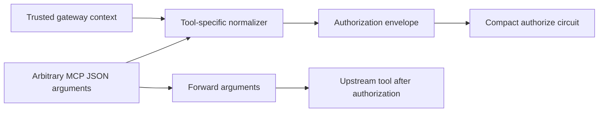

MCP tools are intentionally flexible: every tool defines its own JSON input schema. Zero-knowledge circuits are the opposite: they work best when the statement being proven is explicit, typed, and deterministic.

The **authorization envelope** is the boundary between those two worlds.

## Normalized request

The Midnight client accepts this current request shape:

```ts
interface MidnightAuthorizationRequest {
  agent: string;
  amount?: bigint;
  approved?: boolean;
  resource?: string;
  tool: string;
}
```

This is not the upstream tool payload. It is the minimum set of facts the authorization circuit needs to decide whether the side effect may happen.



## Tool-specific normalization

The prototype deliberately implements normalization explicitly for the three demonstrated tool classes.

### `documents.read`

Input:

```json
{
  "matterId": "matter:thompson",
  "documentId": "settlement-offer.pdf"
}
```

Authorization envelope:

```ts
{
  agent: "LegalAgent",
  tool: "documents.read",
  resource: "matter:thompson"
}
```

`documentId` is relevant to the application but not to the current policy, so it is forwarded to the upstream tool without becoming a circuit input.

### `email.send`

Input:

```json
{
  "to": "outside-counsel@example.com",
  "subject": "Settlement proposal",
  "body": "..."
}
```

Trusted metadata:

```text
io.zkmcp/approval-token
```

Authorization envelope:

```ts
{
  agent: "LegalAgent",
  tool: "email.send",
  approved: true
}
```

The recipient, subject, and body are not currently part of the Compact rule. The current demo policy says that the email capability requires trusted approval at all.

### `payments.transfer`

Input:

```json
{
  "amount": 2750,
  "recipient": "client-settlement-account",
  "memo": "Thompson settlement disbursement"
}
```

Authorization envelope:

```ts
{
  agent: "LegalAgent",
  tool: "payments.transfer",
  amount: 2750n,
  approved: false
}
```

The numeric amount becomes a `Uint<64>`-compatible value in Compact. The recipient and memo are forwarded but are not part of the current proof statement.

## Identity digesting

Before Compact sees textual identifiers, zkMCP converts them to 32-byte digests:

```ts
SHA256("zkmcp:id:v1\0" + value)
```

The domain prefix prevents this digest from being confused with unrelated hashes elsewhere in the protocol. The current implementation uses it for:

- agent identifiers
- tool identifiers
- resource identifiers

The circuit therefore operates on fixed-width values instead of arbitrary strings.

## Unknown tools fail closed

The normalizer does **not** implement a local fallback that means “unknown tool = allowed.”

Unknown tools are still converted into an authorization request and passed to Compact. The private policy has only the committed tool digests, so the circuit rejects an unrecognized capability.

This is an important design rule:

> Extension mistakes should become denials, not accidental authority.

## Why the envelope stays small

A tempting design would hash the entire JSON tool payload and prove over that. That gives a binding commitment, but it does not tell the circuit which business properties matter.

Instead, zkMCP separates:

1. **application arguments** — everything the tool needs to execute;
2. **authorization facts** — only the values the policy constrains;
3. **trusted context** — values the agent must not be able to assert for itself.

That gives each new tool integration an explicit security review point: the normalizer defines exactly what the policy is actually authorizing.

## Extending the envelope

A production policy system will need richer facts than the hackathon prototype. Examples include:

```text
organizationId
projectId
recipientClass
dataClassification
deploymentEnvironment
operationClass
currency
businessHoursWindow
approvalScope
approvalExpiry
```

Those are future protocol design choices. They should be added as explicit typed facts rather than smuggling arbitrary application JSON into the circuit.
