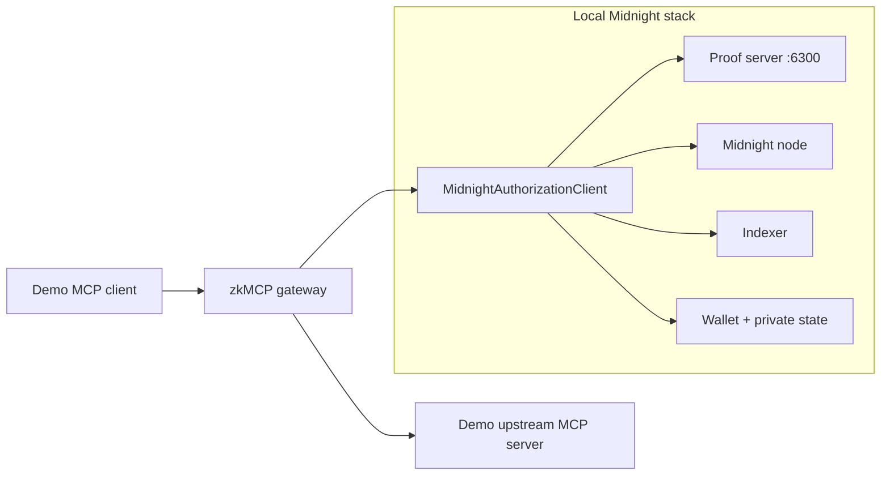
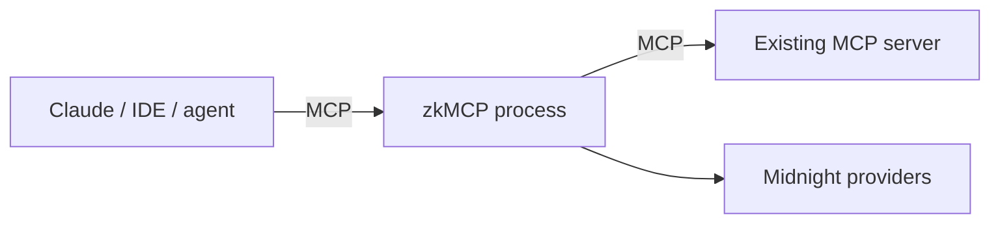
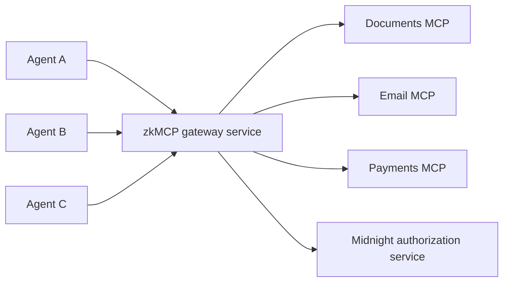

The current repository validates zkMCP on a **local Midnight devnet**, but the gateway boundary is intentionally independent of one UI or one agent runtime.

The core deployment question is simple:

> Where should the authorization gateway live so every sensitive MCP call is forced through it?

## Current hackathon topology

The verified local environment runs all infrastructure on one developer machine:



The repository starts this environment with:

```bash
npm run setup:midnight
```

and the docs/playground stack with:

```bash
npm run demo:ui
```

This topology is designed for deterministic local validation, not production availability.

## Topology A: local wrapper

The simplest adoption model is to run zkMCP next to an existing MCP server and point the agent at zkMCP instead of the upstream server.



**Best for:**

- developer machines;
- a single agent host;
- local tools or stdio MCP servers;
- incremental adoption without rewriting the upstream server.

The main integration work is the tool normalizer and the trusted identity/approval configuration.

## Topology B: shared authorization sidecar

An organization can place zkMCP as a shared boundary in front of one or more MCP services.



**Best for:**

- centrally managed agent infrastructure;
- consistent policy enforcement across multiple clients;
- organizations that want one place to handle approval verification, logging, and proof receipts.

The current prototype does not yet implement multi-tenant policy selection or authenticated remote agent sessions, so this diagram describes the intended deployment shape rather than a production-ready mode.

## Topology C: embedded authorization library

A custom MCP server can call `@zkmcp/midnight` directly before a sensitive handler instead of running a separate protocol proxy.

```text
MCP server request handler
        ↓
application-specific normalization
        ↓
MidnightAuthorizationClient.authorize(...)
        ↓
authorized?
  no  → return MCP error
  yes → perform side effect
```

**Best for:**

- servers where the team controls the handler implementation;
- policies tightly coupled to application domain objects;
- avoiding an extra network/process hop.

The tradeoff is architectural: the authorization boundary becomes part of every server implementation instead of one reusable gateway.

## Policy and prover placement

The private policy should live where the proving process can access it without exposing it to public infrastructure.

A production architecture may separate:

```text
MCP gateway
    │ normalized authorization request
    ▼
private authorizer / prover
    │ proof + transaction
    ▼
Midnight network
```

The current `@zkmcp/midnight` client combines wallet, private state, proof provider, and contract access in one Node.js process for simplicity.

## Network placement

The Midnight client already resolves three network identifiers:

```text
undeployed   local devnet
preview      Midnight preview environment
preprod      Midnight pre-production environment
```

Only the local `undeployed` path has been fully validated for this hackathon build. The docs intentionally do not claim a production or public-network deployment that has not been run end to end.

## Enforcement placement matters

zkMCP only protects a tool if the agent cannot bypass the gateway and call an equivalent unprotected endpoint directly.

For real deployments, the upstream MCP server should therefore be:

- reachable only from the gateway or trusted application boundary; or
- configured with its own authentication such that the agent's credentials only permit the gateway-mediated route.

Otherwise zkMCP becomes an optional audit path rather than an enforceable authorization boundary.

## Choosing a topology

| Requirement | Recommended starting topology |
| --- | --- |
| one developer + local MCP server | local wrapper |
| many agent clients + centrally managed services | shared sidecar |
| custom MCP server under your control | embedded authorization |
| strict separation of policy secrets from gateway process | gateway + remote/private authorizer |

The protocol idea does not depend on one topology. The invariant does: **all sensitive execution paths must cross the authorization boundary.**
