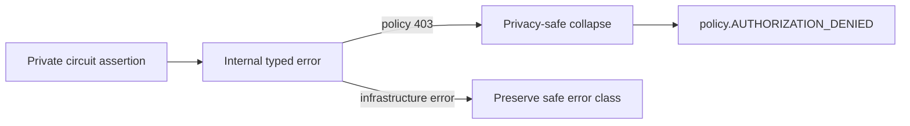
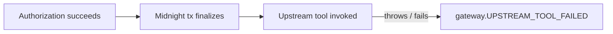

A security gateway needs predictable failure behavior. zkMCP therefore separates **authorization denials** from **infrastructure failures** and from **post-authorization upstream failures**.

The distinction matters because the correct retry behavior is different for each class.

## Failure taxonomy

| Stage | Error family | Typical status | Retryable? | Upstream tool called? |
| --- | --- | ---: | ---: | ---: |
| normalization | `gateway.INVALID_MCP_REQUEST` | 400 | no | no |
| private policy | `policy.AUTHORIZATION_DENIED` | 403 | no | no |
| replay | `replay.NULLIFIER_ALREADY_USED` | 409 | no | no |
| proof server | `proof.SERVER_UNAVAILABLE` | 503 | yes | no |
| proof generation | `proof.GENERATION_FAILED` | 500 | yes | no |
| proof verification | `proof.VERIFICATION_FAILED` | 403 | no | no |
| contract/indexer | `midnight.*` | 5xx | depends | no |
| upstream execution | `gateway.UPSTREAM_TOOL_FAILED` | 502 | yes | **yes** |

The current implementation uses typed evlog error catalogs in `@zkmcp/core` so code, stage, HTTP-style status, and retryability stay stable across the gateway and Midnight layers.

## Private policy denials are intentionally generic

Internally the Compact assertion may fail because of a specific rule:

```text
wrong agent
unknown tool
wrong resource
amount above maximum
approval required
```

Returning that exact reason would reveal information about a private policy.

The public-facing metadata therefore collapses private 403 failures to:

```text
policy.AUTHORIZATION_DENIED
```

The caller learns that authority was not granted, but not which hidden constraint caused the denial.



## Denial is not an exception after execution

The most important behavior is ordering:

```text
normalize → authorize → prove/finalize → upstream tool
```

not:

```text
upstream tool → discover violation → report error
```

When authorization fails, `ZkMcpGateway.handleToolCall()` returns an MCP `isError` result before `upstream.callTool()` is reached.

The Phase 2 tests assert this explicitly with an upstream execution counter.

## Infrastructure failures also fail closed

If the proof server, indexer, contract, or wallet path is unavailable, zkMCP does not “degrade” into an unprotected tool call.

Examples:

```text
proof server unavailable → no tool execution
contract unavailable     → no tool execution
indexer unavailable      → no tool execution
invalid local policy     → no tool execution
```

This is deliberate. Availability problems must not silently become authorization bypasses.

## The special case: upstream failure

An upstream failure happens **after** successful authorization:



At that point an authorization transaction already exists. This means a retry policy must understand the semantics of the upstream operation.

For idempotent reads, retry may be straightforward. For payments or external sends, blindly retrying could create a duplicate side effect even though a new authorization would use a fresh nonce.

Production callers should therefore combine zkMCP's retryability metadata with **application-specific idempotency keys and operation semantics**.

## MCP error metadata

Blocked calls attach privacy-safe metadata under:

```text
io.zkmcp/authorization-error
```

A representative shape is:

```json
{
  "code": "policy.AUTHORIZATION_DENIED",
  "retryable": false,
  "stage": "policy",
  "status": 403
}
```

The human-readable MCP content remains safe and does not serialize internal causes or private witness values.

## Operational rule

For protected tools, the recommended caller behavior is:

1. **400** — fix request shape; do not retry unchanged.
2. **403 policy** — treat as denied; do not infer the hidden rule.
3. **409 replay** — build a fresh authorization context.
4. **retryable 5xx before upstream** — infrastructure retry may be safe.
5. **upstream failure after authorization** — use application idempotency rules before deciding to retry.
