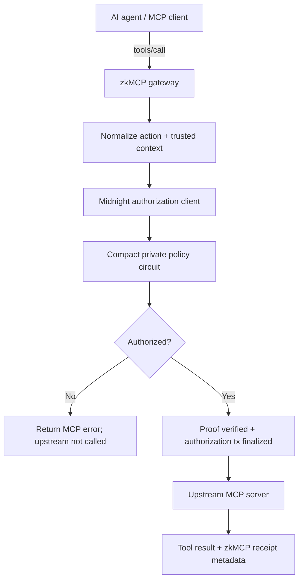
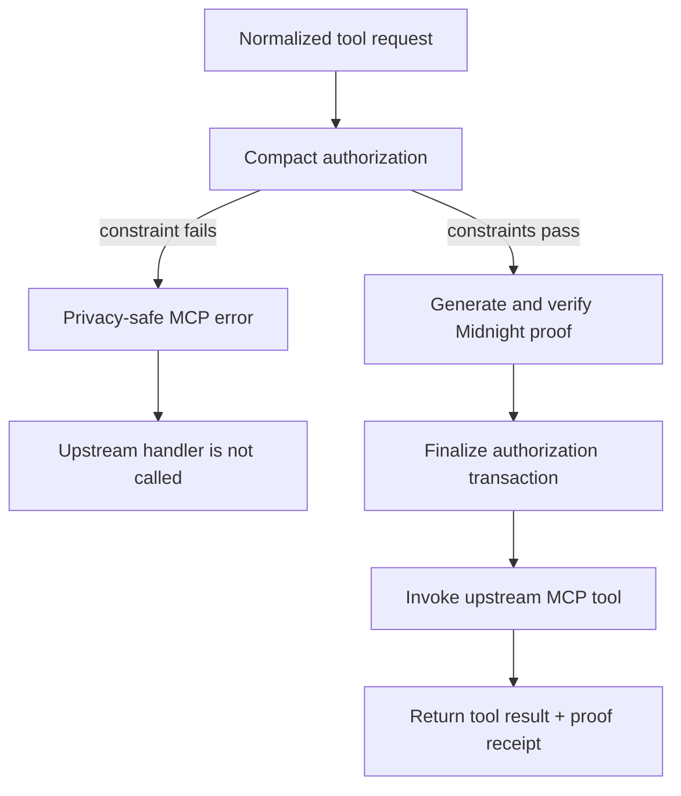

zkMCP is a **pre-execution authorization gateway**. It does not replace MCP, the agent framework, or the upstream tool server. It inserts a deterministic security boundary between an agent's requested action and the code that performs that action.

The core path has four systems with deliberately different responsibilities:



## Component responsibilities

| Component | Owns | Must not do |
| --- | --- | --- |
| **MCP client / agent** | proposes `tools/call` requests | grant itself authority |
| **zkMCP gateway** | request normalization, trusted context, fail-closed routing | silently bypass authorization for unknown sensitive calls |
| **Midnight client** | wallet/providers, private witness state, proof transaction, receipt extraction | publish private policy/request values in application metadata |
| **Compact contract** | deterministic policy constraints, commitment binding, replay protection | reason about LLM quality or application semantics |
| **Upstream MCP server** | performs the real business action | execute before zkMCP returns authorization |

The separation is intentional. The AI model remains probabilistic; the boundary that decides whether a sensitive side effect may happen is deterministic.

## The invariant

For a protected tool, the gateway follows one invariant:

> **No successful authorization receipt, no upstream execution.**

A request can therefore end in one of two states:



## What is deterministic

The model can generate arbitrary prose and reasoning, but zkMCP reduces the requested side effect into a small authorization envelope:

```ts
interface MidnightAuthorizationRequest {
  agent: string;
  tool: string;
  resource?: string;
  amount?: bigint;
  approved?: boolean;
}
```

The Compact circuit then reasons only about those deterministic facts and the private policy committed at deployment.

This is why zkMCP does **not** attempt to prove LLM inference. The useful security statement is smaller:

> The concrete action that was about to execute satisfied the committed authorization policy.

## Read next

<Cards>
  <Card title="Request lifecycle" href="/docs/architecture/request-lifecycle">
    Follow a `tools/call` from the agent through normalization, proving, finalization, and upstream execution.
  </Card>
  <Card title="Authorization envelope" href="/docs/architecture/authorization-envelope">
    See exactly how flexible MCP arguments become deterministic circuit inputs.
  </Card>
  <Card title="Trust boundaries" href="/docs/architecture/trust-boundaries">
    Understand which values are agent-controlled, gateway-trusted, private, and public.
  </Card>
  <Card title="State and commitments" href="/docs/architecture/state-and-commitments">
    Inspect policy commitments, execution commitments, nullifiers, and ledger state.
  </Card>
</Cards>
