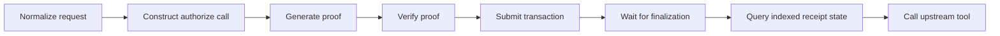

The hackathon implementation optimizes for **correctness and demonstrability**, not low-latency production proving.

On the current local machine, a successful authorization usually takes roughly **20–25 seconds** because it includes proof generation, verification, transaction submission, finalization, and indexed state readback.

A private policy denial is often much faster because the circuit assertion fails before a successful proof-backed transaction is finalized.

## Current timing path



The receipt's `proofDurationMs` currently measures the client-side authorization operation from immediately before `callTx.authorize(...)` until the transaction result and ledger receipt are available. It is therefore broader than “pure prover CPU time.”

## Why denials can return quickly

A request that violates a private Compact assertion does not proceed to the same successful transaction path.

Examples include:

```text
wrong matter
missing approval
amount above private maximum
wrong agent
unknown tool
```

The caller still learns only a generic `policy.AUTHORIZATION_DENIED`, but the upstream tool can be stopped without waiting for a successful proof receipt.

## Current serialization

`MidnightAuthorizationClient` deliberately serializes calls through an `authorizationTail` promise.

Conceptually:

```text
request A ─ prove/finalize ─┐
                           ├─ request B ─ prove/finalize ─ request C ...
request B waits ────────────┘
```

This avoids unsafe concurrent mutation of the current wallet/provider/private-state path while the prototype is still using one client instance and one local wallet context.

It is not a claim that the protocol fundamentally requires global serialization.

## Where time can be reduced later

Several optimizations are plausible, but they have different security properties.

### 1. Parallel proving contexts

Independent wallet/provider contexts could authorize unrelated requests concurrently.

The engineering work is making transaction state, private storage, and nonce/nullifier handling concurrency-safe.

### 2. Remote or optimized proving infrastructure

The local Docker proof server is convenient for a hackathon but not tuned as a production service. Dedicated proving infrastructure can improve throughput and isolate heavy proving work from the MCP gateway process.

### 3. Pre-authorization / scoped capabilities

For some workloads, a human or policy engine could authorize a narrow capability in advance:

```text
agent X may call tool Y
for resource Z
until time T
up to amount N
```

The agent would then prove possession/scope of that capability per action instead of recomputing every policy decision from scratch.

This changes the protocol model and is future work, not a current optimization.

### 4. Batch authorization

A workflow may know several planned actions in advance. A circuit could potentially authorize a bounded batch or a policy-constrained action set.

Batching can reduce per-action overhead, but it must preserve clear replay and partial-execution semantics.

### 5. Proof caching — only with very careful binding

Caching is dangerous if a proof can be replayed for a different action.

A reusable result would need to be bound to all relevant execution facts, freshness constraints, and replay state. The current nullifier design intentionally prevents reuse of the same authorization nonce.

“Cache the last proof” is therefore **not** a safe optimization by itself.

## Application latency strategy

Not every tool should necessarily use the same authorization UX.

| Tool class | Reasonable product behavior |
| --- | --- |
| destructive / financial side effect | wait synchronously for authorization before execution |
| external communication | wait, or use a human approval workflow that is already asynchronous |
| sensitive read | wait if confidentiality boundary requires it |
| low-risk repeated operation | consider future scoped capabilities or pre-authorization |

The important constraint is that perceived latency must never be reduced by executing the protected side effect before authorization finalizes.

## Benchmarking correctly

When zkMCP moves beyond the prototype, benchmarks should separate:

```text
normalization time
private-state lookup
proof generation
proof verification
transaction submission
network finalization
indexer visibility
upstream MCP latency
```

That makes it possible to optimize the actual bottleneck instead of treating the entire authorization request as one opaque number.

## Current honest statement

Today, zkMCP proves the architecture works end to end, but successful local proofs are expensive enough that the system should be viewed as a **correct prototype of the authorization boundary**, not a finished low-latency production gateway.
