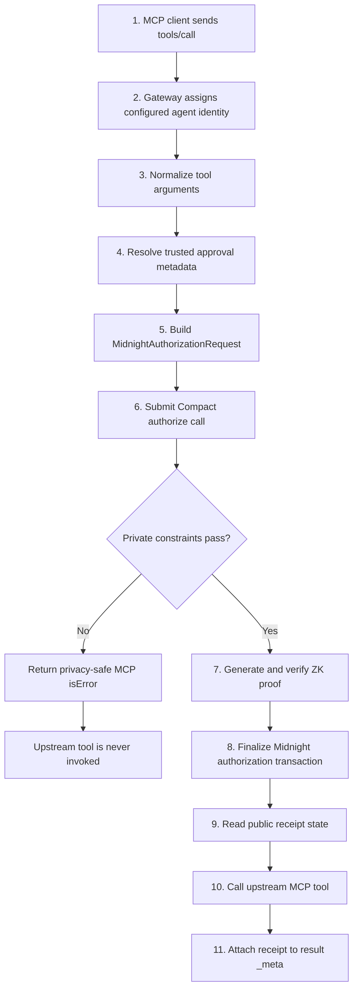

A protected request crosses three distinct boundaries: **protocol handling**, **private authorization**, and **side-effect execution**. Keeping those boundaries separate is what makes the behavior auditable.



## 1. Receive `tools/call`

The gateway exposes a normal MCP server interface. The agent does not call the upstream server directly; it connects to the gateway as if the gateway were the MCP server.

The gateway's `tools/list` behavior is intentionally transparent, while `tools/call` is intercepted.

## 2. Assign agent identity

The agent identity comes from gateway configuration:

```ts
new ZkMcpGateway({
  agentId: "LegalAgent",
  approvalVerifier,
  authorizer,
  upstream,
});
```

The current gateway does **not** trust a tool argument such as `agentId` to identify the principal. This prevents the model from selecting a more privileged identity in its own request body.

## 3. Normalize application arguments

MCP tools can accept arbitrary JSON-shaped arguments. Compact circuits should not reason over arbitrary JSON.

`normalizeToolCall()` translates the application request into a small deterministic envelope. For example:

| MCP tool | Application input used for authorization | Circuit fact |
| --- | --- | --- |
| `documents.read` | `matterId` | `resource` |
| `email.send` | trusted approval metadata | `approved` |
| `payments.transfer` | integer `amount` + trusted approval | `amount`, `approved` |

The original application arguments are preserved separately as `forwardArguments` and are sent upstream only if authorization succeeds.

## 4. Resolve trusted context

Some facts must come from a source other than the agent-controlled arguments.

The current example is human approval. The gateway reads `io.zkmcp/approval-token` from MCP `_meta`, passes it to an `ApprovalVerifier`, and only then derives the boolean that Compact sees.

```text
agent arguments                 trusted metadata
---------------                 ----------------
approved: true     ✕            approval token → verifier → approved: true
```

## 5. Construct the authorization request

The normalized request is passed to `@zkmcp/midnight`:

```ts
interface MidnightAuthorizationRequest {
  agent: string;
  amount?: bigint;
  approved?: boolean;
  resource?: string;
  tool: string;
}
```

Before entering Compact, textual identifiers are domain-separated SHA-256 digests:

```text
SHA-256("zkmcp:id:v1\0" || identifier)
```

This gives the circuit fixed-width `Bytes<32>` values for agent, tool, and resource identifiers.

## 6. Evaluate the committed private policy

`MidnightAuthorizationClient.authorize()` calls the Compact `authorize` circuit with:

- the digested agent
- the digested tool
- the optional digested resource
- the numeric amount, or zero when unused
- the verified approval boolean
- a fresh random 32-byte nonce

The circuit first recomputes the private policy commitment and verifies that it equals the commitment pinned at deployment. Only then are the tool-specific constraints evaluated.

## 7–9. Prove, finalize, and read receipt state

A successful circuit execution goes through the Midnight proof provider and node. The client waits for the authorization transaction to finalize, then queries indexed contract state to construct the public receipt.

The receipt includes:

```text
policyCommitment
executionCommitment
nullifier
transactionId
blockHeight
contractAddress
network
proofDurationMs
```

None of those fields require the raw policy or raw tool arguments to be published.

## 10. Invoke the upstream tool

Only after the receipt exists does the gateway execute:

```ts
await upstream.callTool({
  name: input.name,
  arguments: normalized.forwardArguments,
});
```

This ordering is the main security property of the gateway. Authorization is not an audit record written after a side effect; it is a prerequisite for the side effect.

## 11. Return result + receipt

The upstream result is returned normally, with the authorization receipt added under:

```text
io.zkmcp/authorization-receipt
```

A client that understands zkMCP can inspect the receipt. A client that ignores the extra metadata can still consume the ordinary MCP tool result.

## Failure paths

| Stage | Example | Upstream called? | Receipt? |
| --- | --- | ---: | ---: |
| request normalization | malformed payment amount | no | no |
| private policy | amount above maximum | no | no |
| private policy | wrong resource | no | no |
| replay protection | nullifier already used | no | no |
| proof infrastructure | prover unavailable | no | no |
| Midnight infrastructure | contract/indexer unavailable | no | no |
| upstream execution | tool throws after authorization | yes | authorization already exists |

The final row is intentionally different: authorization proves permission to attempt the action. It cannot guarantee that the upstream system itself will succeed.
