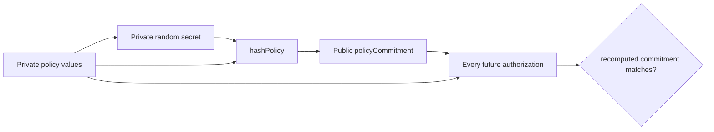

zkMCP deliberately separates **private witness state** from **public verification state**. The public contract stores enough information to bind and replay-protect authorizations, but not the raw policy or request.

## Private policy state

The current Compact policy is:

```text
Policy
├── secret: Bytes<32>
├── allowedAgent: Bytes<32>
├── documentsTool: Bytes<32>
├── emailTool: Bytes<32>
├── paymentsTool: Bytes<32>
├── allowedResource: Bytes<32>
├── maxPaymentAmount: Uint<64>
└── paymentApprovalThreshold: Uint<64>
```

The local TypeScript layer persists that policy to `.zkmcp-policy.json` with file mode `0600`. That file is gitignored and is not public ledger state.

The random `secret` matters because some policy values have low entropy. A payment ceiling such as `5000` or a matter identifier from a small set should not be brute-forceable from a public commitment.

## Policy commitment

At contract construction, Compact computes:

```text
persistentHash(
  "zkmcp:policy:v2",
  policy.secret,
  policy.allowedAgent,
  policy.documentsTool,
  policy.emailTool,
  policy.paymentsTool,
  policy.allowedResource,
  policy.maxPaymentAmount,
  policy.paymentApprovalThreshold
)
```

The resulting `policyCommitment` is disclosed and stored in sealed ledger state.



The domain tag `zkmcp:policy:v2` makes the hash purpose explicit and prevents the same tuple from being interpreted as another protocol object.

## Execution commitment

For an allowed action, Compact hashes the private execution context:

```text
persistentHash(
  "zkmcp:execution:v2",
  policyCommitment,
  requestAgent,
  requestTool,
  requestResource,
  requestAmount,
  approved,
  nonce
)
```

Only the resulting `executionCommitment` is disclosed.

This means the public receipt can be tied to one concrete private authorization context without exposing that context directly.

The current prototype does not yet provide an external API for selectively opening an execution commitment to a third party. The commitment is the cryptographic binding needed for that class of audit workflow later.

## Nullifier

Replay protection uses a separate domain-separated hash:

```text
persistentHash(
  "zkmcp:nullifier:v1",
  policy.secret,
  nonce
)
```

The nullifier is public. The nonce and policy secret are not.

Before completing authorization, Compact checks:

```text
!usedNullifiers.member(publicNullifier)
```

and then inserts the nullifier into the public set.

This gives the verifier a stable public replay marker without publishing the private nonce.

## Public ledger state

The current contract exposes:

| Ledger field | Visibility | Purpose |
| --- | --- | --- |
| `policyCommitment` | public, sealed | binds all authorizations to the deployment policy |
| `usedNullifiers` | public set | rejects replay of an already-used authorization nonce |
| `lastExecutionCommitment` | public | latest successful authorization commitment |
| `lastNullifier` | public | latest successful nullifier |
| `authorizationCount` | public | number of successful authorizations |

The last-execution fields exist because the hackathon client reads a compact receipt from current state after finalization. A production receipt/indexing design may prefer event-like historical indexing or a receipt registry rather than “latest value” fields.

## Public receipt vs private facts

```text
PRIVATE / LOCAL                         PUBLIC / VERIFIABLE
---------------                         -------------------
policy secret                           policy commitment
allowed agent                           execution commitment
allowed resource                        nullifier
private maximum                         transaction id
approval threshold                      block height
requested amount                        contract address
approval context                        network
raw tool arguments                      proof duration (app metadata)
nonce
```

The goal is not to make authorization invisible. The goal is to make **authorization verifiable without making its sensitive inputs public**.

## Why commitments are not enough by themselves

A hash alone only says “someone committed to some bytes.” zkMCP combines commitments with circuit constraints:

1. the private policy must hash to the deployment commitment;
2. the request must satisfy the policy;
3. the execution commitment must be derived from that same request and policy;
4. the nullifier must be fresh;
5. the successful call must finalize before upstream execution.

That combination is what turns a hash into useful authorization evidence.
