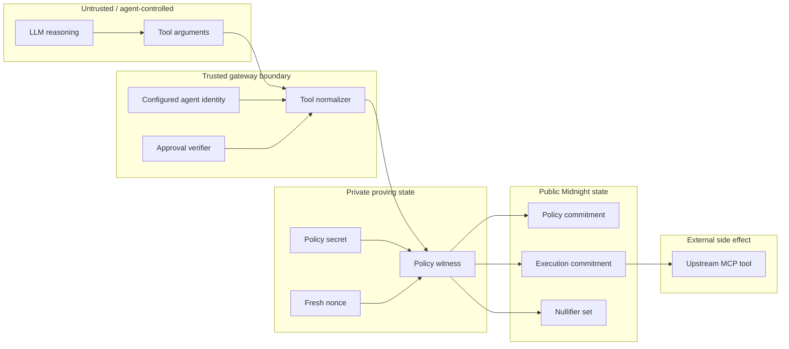

zkMCP is useful only if it is clear **who is allowed to assert each fact**. The architecture therefore treats request values differently depending on where they originate.



## Trust table

| Value or subsystem | Trust level | Why |
| --- | --- | --- |
| LLM reasoning | untrusted for authorization | probabilistic output can be wrong, manipulated, or adversarial |
| tool arguments | agent-controlled | the model chooses the action payload |
| gateway `agentId` | trusted configuration | the model does not choose its own principal in the current design |
| approval token | untrusted until verified | metadata is only useful after an `ApprovalVerifier` accepts it |
| normalized authorization facts | trusted derivation | produced by code that maps request + trusted context to the proof statement |
| private policy witness | trusted local secret state | defines the policy the prover is claiming to use |
| Compact witness output | constrained, not blindly trusted | the circuit recomputes and binds the policy to the public commitment |
| Midnight public ledger | public verification state | commitments, nullifiers, and transaction state are intentionally observable |
| upstream MCP tool | outside the proof | zkMCP proves authorization to invoke it, not that its implementation is correct |

## The agent cannot assert its own identity

The current gateway assigns the principal from configuration:

```ts
const gateway = new ZkMcpGateway({
  agentId: "LegalAgent",
  approvalVerifier,
  authorizer,
  upstream,
});
```

A request body containing another agent identifier does not change the authorization principal.

In a production multi-agent system, this static configuration would likely be replaced by a cryptographically authenticated or session-bound agent identity. That is future work; the important property is the same: **identity comes from the trust boundary, not from an ordinary tool argument.**

## The agent cannot approve itself

For the same reason, this should never be authoritative:

```json
{
  "approved": true
}
```

The prototype instead uses trusted MCP metadata:

```text
io.zkmcp/approval-token
```

The gateway verifies the token and derives the private boolean supplied to Compact. The fixed-token verifier is deliberately only a local demo adapter; production approval should be signed, scoped, expiring, and bound to an execution context.

## The witness is not accepted on faith

Compact witnesses provide private values, but zkMCP still constrains those values against public state.

Every `authorize` call performs:

```text
hashPolicy(privatePolicy) == ledger.policyCommitment
```

This prevents the prover from swapping in an easier policy immediately before generating a proof.

## What the ledger is trusted for

The public ledger is used for evidence and replay state, not for storing the private policy.

Public state currently includes:

```text
policyCommitment
usedNullifiers
lastExecutionCommitment
lastNullifier
authorizationCount
```

The policy values that produced the commitment remain in private local state.

## What remains outside the guarantee

Even a valid authorization proof cannot guarantee all properties of the real-world action. zkMCP does not prove:

- that the LLM's reasoning was sensible;
- that the upstream tool has no bugs;
- that an email provider actually delivered a message;
- that an external payment network later settles successfully;
- that a document returned by an upstream system is factually correct;
- that a human approval authority was legitimate unless the configured verifier establishes that fact.

The proof statement is deliberately narrower:

> **The gateway's deterministic authorization facts satisfied the committed policy before the gateway invoked the upstream tool.**
