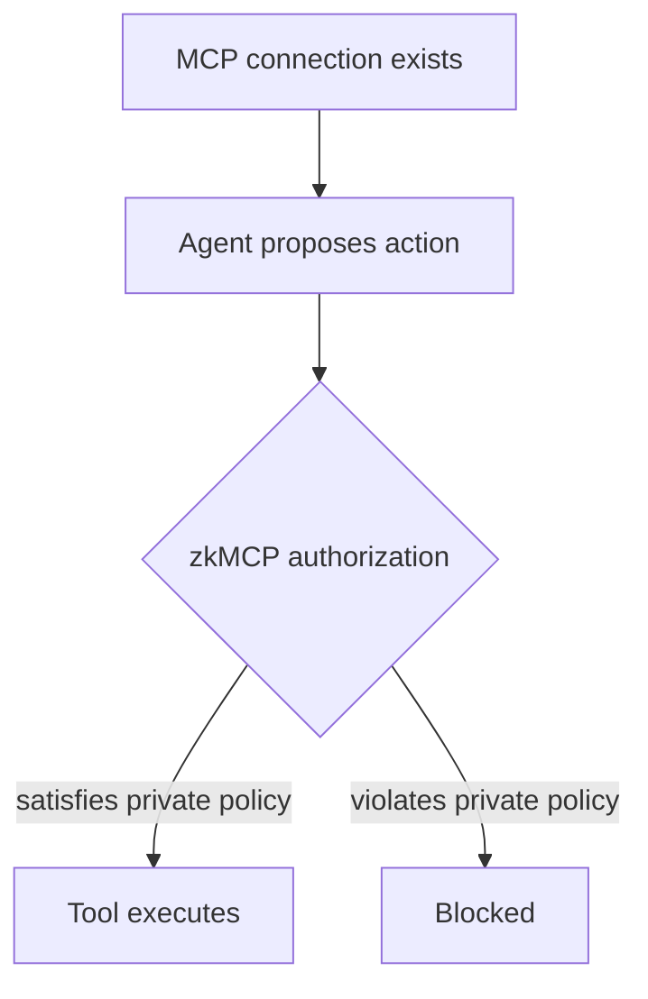

MCP gives an agent a standardized way to reach tools. That connection is necessary, but it is not a complete authorization model for autonomous actions.

Consider an agent connected to a payment MCP server:

- **Access:** the agent can call `payments.transfer`.
- **Intent:** the model chooses to transfer £2,750.
- **Authority:** the transfer is allowed by the user's policy.

zkMCP enforces the third step.

This matters because coarse access is common while authority is contextual. A document agent may need access to a document server without permission to every matter. An email agent may draft freely but require approval before external sends. A finance agent may transfer below a private limit without learning the limit itself.
