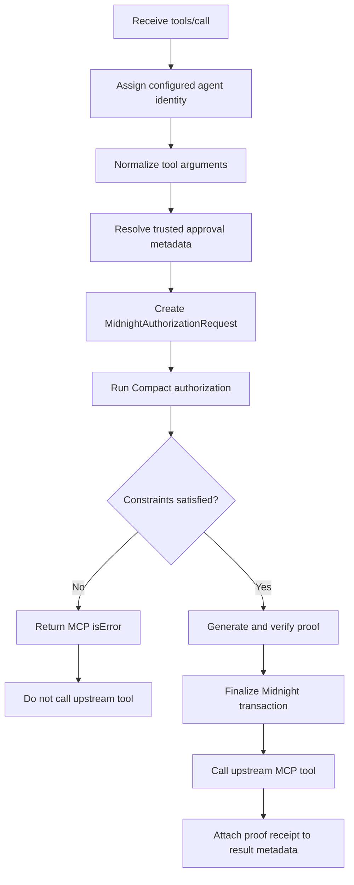

Every protected `tools/call` goes through the same boundary.

## Fail closed

Malformed requests fail during normalization. Unknown tools still go through Midnight rather than being implicitly allowed. Private policy failures return `policy.AUTHORIZATION_DENIED`, and the upstream MCP handler is never invoked.

## Authorized path

A successful Compact call produces a finalized Midnight transaction and a public receipt. Only after that receipt exists does the gateway forward the original tool call upstream.
