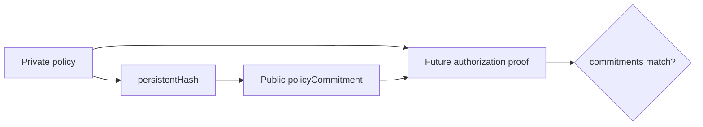

The prototype keeps the policy in local private witness state. At deployment, Compact hashes the complete policy into a public `policyCommitment`.

The current policy includes:

```text
policy secret
allowed agent
allowed document tool
allowed email tool
allowed payment tool
allowed resource
private payment maximum
private approval threshold
```

Every authorization later recomputes the policy commitment inside the circuit and asserts that it matches the commitment pinned at deployment.



This prevents a prover from swapping in an easier policy immediately before authorizing an action.

### Current limitation

One immutable private policy is committed per contract deployment. Rotation, revocation, and multiple policy sets are future work.
