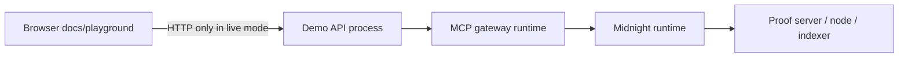

The repository is intentionally split along runtime boundaries instead of putting the MCP server, proof code, UI, and contracts into one package.

```text
zkMCP/
├── apps/
│   └── web/                    Fumadocs portal + playground + Scalar reference
├── packages/
│   ├── core/                   errors, privacy-safe logging, shared runtime policy
│   ├── gateway/                MCP server/client proxy and tool normalization
│   └── midnight/               Compact contract, wallet/providers, proof client
├── docs/                       build-phase engineering notes
├── biome.jsonc
├── package.json
└── package-lock.json
```

## Package dependency direction

```mermaid
flowchart TD
    W[apps/web] --> D[demo HTTP API]
    D --> G[@zkmcp/gateway]
    G --> C[@zkmcp/core]
    G --> M[@zkmcp/midnight]
    M --> C
    M --> K[Compact managed bindings]
    K --> X[authorization.compact]
```

The important dependency rule is that `@zkmcp/core` knows nothing about MCP or Midnight. It contains the error and observability primitives both infrastructure layers can use.

## `@zkmcp/core`

Key files:

```text
packages/core/src/
├── errors.ts
├── errors.test.ts
├── logging.ts
├── logging.test.ts
└── index.ts
```

Responsibilities:

- typed evlog error catalogs;
- stable error stage/status/retryability metadata;
- privacy-safe error projection;
- structured authorization-event logging;
- redaction/allowlist policy for sensitive fields.

This package should stay protocol-independent. A future non-Midnight authorizer or non-MCP adapter could still use the same error/privacy model.

## `@zkmcp/gateway`

Key files:

```text
packages/gateway/src/
├── gateway.ts
├── normalize.ts
├── approval.ts
├── stdio.ts
├── demo-tools.ts
├── demo-runtime.ts
├── demo-api.ts
└── *.test.ts
```

Responsibilities:

- expose the MCP server seen by the agent;
- hold/connect the upstream MCP client;
- transparently proxy `tools/list`;
- intercept `tools/call`;
- assign configured agent identity;
- resolve trusted approval metadata;
- normalize application arguments into authorization facts;
- call an authorization backend;
- forward original arguments only after successful authorization;
- merge proof receipt metadata into the MCP result.

`GatewayAuthorizationBackend` is intentionally narrow:

```ts
interface GatewayAuthorizationBackend {
  authorize(
    request: MidnightAuthorizationRequest
  ): Promise<MidnightAuthorizationReceipt>;
  close?(): Promise<void>;
}
```

The gateway should not depend on Midnight provider internals.

## `@zkmcp/midnight`

Key files:

```text
packages/midnight/
├── contracts/
│   ├── authorization.compact
│   └── managed/               generated Compact bindings/assets
└── src/
    ├── authorization-state.ts
    ├── client.ts
    ├── deploy.ts
    ├── setup.ts
    ├── wallet.ts
    ├── network.ts
    └── demo.ts
```

Responsibilities:

- define and compile the Compact authorization contract;
- create/load private policy witness state;
- map textual identifiers to fixed 32-byte digests;
- configure Midnight wallet/proof/indexer/private-state providers;
- connect to the deployed contract;
- generate a fresh nonce per request;
- submit the proof-backed authorization transaction;
- read public receipt state;
- classify low-level Compact/Midnight failures into typed zkMCP errors.

Generated `contracts/managed` output is a build artifact and is excluded from linting rules that are intended for hand-written source.

## `apps/web`

The web app is documentation infrastructure rather than a marketing frontend.

```text
apps/web/
├── app/
│   ├── docs/[[...slug]]/      Fumadocs page renderer
│   ├── api/search/            Fumadocs search endpoint
│   ├── api-reference/         Scalar route
│   └── openapi.json/          OpenAPI document for demo HTTP bridge
├── components/
│   ├── authorization-playground.tsx
│   └── mdx/
│       └── mermaid.tsx        Beautiful Mermaid + click-to-zoom
├── content/docs/              public developer documentation
└── lib/
    ├── source.ts
    ├── demo-data.ts
    └── live-api.ts
```

The browser does not bundle the Midnight wallet/proving runtime. In live playground mode it talks to the local demo HTTP bridge, which owns the real MCP + Midnight runtime.

## Runtime boundaries



That separation keeps WASM/wallet/proving dependencies out of the Next.js client bundle and makes recorded documentation mode fully self-contained.

## Generated and private files

The repository intentionally ignores runtime/generated state such as:

```text
.next/
.source/
contracts/managed/ for lint purposes
.midnight-state.json
.midnight-wallet-state/
.zkmcp-policy.json
authorization-state/
midnight-level-db/
.evlog/
```

Do not commit wallet, policy, proof-runtime, or local chain state.

## Quality gates

From the repository root:

```bash
npm run foundation:check
```

runs:

```text
Ultracite / Biome
→ TypeScript builds
→ core + gateway tests
→ Compact contract compilation
```

End-to-end Midnight tests are more expensive and run separately when validating the real proving path.
