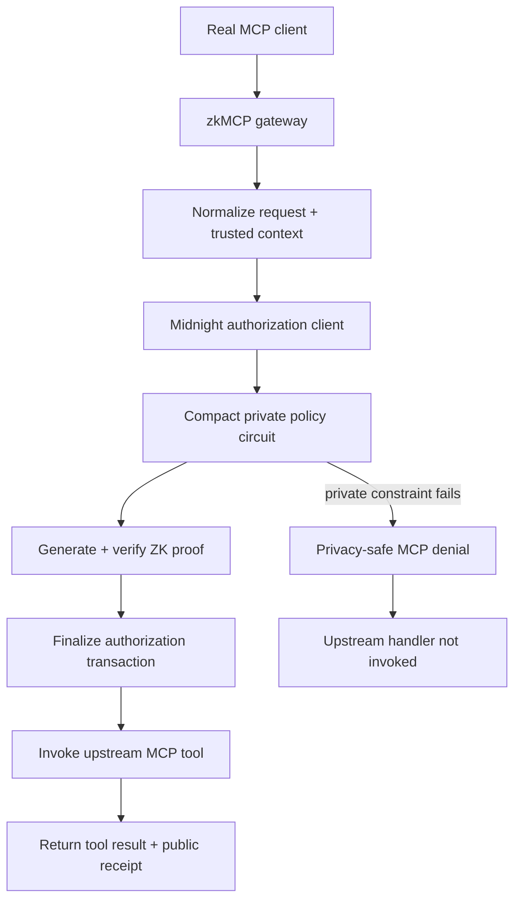

This page records the final integration verification run performed on **29 August 2026** before submission packaging.

It is evidence for the implementation that exists in this repository. It is **not** a claim that zkMCP is deployed to Midnight Preprod or another public production network. The validated network here is the local Midnight `undeployed` environment.

## Reproduce the run

From the repository root:

```bash
npm install
npm run setup:midnight
npm run demo:gateway
```

`setup:midnight` starts the local node, indexer, and proof server, compiles `authorization.compact`, deploys the contract, and records the local deployment for the TypeScript client.

The final verification deployment was:

```text
contract
ddbe8f734862392428c7e55194ed00a9ac8d00a99cf41cfe81f27afb345793ac

policy commitment
0x8b701e17a4e1ae066971baa4aaa90bced67eb127a606c73b532589a77e9eaa99

network
undeployed
```

## MCP gateway result

The real MCP integration suite passed **8/8**:

```text
ALLOW  assigned matter document           proof + upstream execution
DENY   unrelated matter document          blocked before upstream execution
DENY   external email without approval    blocked before upstream execution
ALLOW  external email with approval       proof + upstream execution
ALLOW  payment below private threshold    proof + upstream execution
DENY   payment needs approval             blocked before upstream execution
ALLOW  payment with human approval        proof + upstream execution
DENY   payment above private maximum      blocked before upstream execution
```

The gateway exposed the upstream tools through MCP:

```text
documents.read
email.send
payments.transfer
```

For every denied case, the result contained `policy.AUTHORIZATION_DENIED`, no authorization receipt was attached, and the upstream handler was not invoked.

## Fresh successful receipts

### Assigned matter document

```text
block                 3187
transaction           00f3ac51f4a5658ffc3432d62cdae2a15c509769afdfb56e641cca5cfda2e21298
execution commitment  0x8e855e73bd847db6ddc2bda329cb3a98ec6954fd72908abe3c113dcbe61dd186
nullifier             0xad07ac85f4fe3c1977b3b9060e9a616536e1aa1273bcac044f3aa98072b63de0
authorization time    29.628s
```

### External email with trusted approval

```text
block                 3191
transaction           00f726b838d83ac01ae5df43330dc074de8845e112a9f6d4675414d5f21462b7c4
execution commitment  0x374c42b97d0e20d559ae754797e00f40078ba76cb483b2f052bddcf2a9adc206
nullifier             0x4fae92d521b56b149878e297498e78406c145a53b51fae9ee573136443ea5b7b
authorization time    23.802s
```

### Payment below private threshold

```text
block                 3195
transaction           00b4a29f85034bd28b8ddb0fe728d99ac511e5c6306506be9a94ac6830c95d05c3
execution commitment  0xef1c6919b1c6158f448902da6de5a166e232222c429cec1f6835b0500e5e07d0
nullifier             0x275b33c1ce1115d01d88d1e69e8ced7b48f699b8ca9c19b7d5863b61097eeb9b
authorization time    24.046s
```

### Payment with trusted human approval

```text
block                 3199
transaction           00c3ddd1aca7df1c9fbfec1cac5e13d9c2f82afe2e9ecabe620b7fb19ca7f43192
execution commitment  0x89d1d410fe2321ef9193a904cfe18addae0860baf7c811cd5c9532e29184c60e
nullifier             0x5de1aa380349c5fc5dbc01040d9fd117d0fd4ed5e3dc2583987e14c6a9be7d90
authorization time    23.909s
```

The recorded-mode playground uses these final verification receipts so the public documentation can demonstrate the real proof output without requiring a browser visitor to run Midnight locally.

## Proof-server evidence

During the same run, the Midnight proof server repeatedly logged the real proving path:

```text
Starting to process request for /prove...
proof created; verifying to make sure
proof ok
POST /prove
```

Successful authorizations generated proof traffic before their transactions finalized. Private policy denials returned without a successful authorization receipt.

## What this verifies

The run verifies this ordering end to end:



This is the claim zkMCP makes: **authorization is proven before protected execution, while the policy and constrained request facts do not need to be published as raw ledger fields.**
