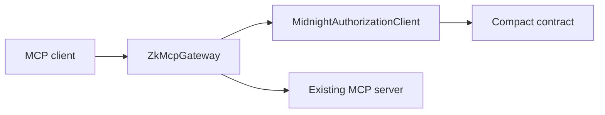

The current API is deliberately low-level. zkMCP does not yet expose a policy DSL or a one-line `wrapServer()` helper. The working gateway is composed from four pieces:

1. a configured agent identity
2. an approval verifier
3. a Midnight authorization backend
4. an upstream MCP client

```ts
import { ZkMcpGateway } from "@zkmcp/gateway";
import { DenyAllApprovalVerifier } from "@zkmcp/gateway/approval";
import { createMidnightAuthorizationClient } from "@zkmcp/midnight";

const authorizer = await createMidnightAuthorizationClient();

const gateway = new ZkMcpGateway({
  agentId: "LegalAgent-01",
  approvalVerifier: new DenyAllApprovalVerifier(),
  authorizer,
  upstream: {
    listTools: (input) => upstreamClient.listTools(input),
    callTool: (input) => upstreamClient.callTool(input),
    close: () => upstreamClient.close(),
  },
});

const server = gateway.createServer();
```

`ZkMcpGateway` returns a normal MCP server. Your host connects to the gateway; the gateway connects to the existing MCP server.



## `tools/list`

`tools/list` is passed through to the upstream MCP server. zkMCP also records output schemas so it can correctly project upstream tool results.

## `tools/call`

`tools/call` is intercepted. The gateway:

1. extracts the tool name and arguments
2. resolves trusted approval metadata
3. normalizes the request into a `MidnightAuthorizationRequest`
4. calls the Midnight authorization backend
5. blocks on any authorization error
6. forwards the original tool arguments only after authorization succeeds
7. attaches the public receipt under `io.zkmcp/authorization-receipt`

The current normalizer has explicit mappings for `documents.read`, `email.send`, and `payments.transfer`. Unknown tools still go through Midnight rather than silently falling back to an allow path.

> The workspace packages shown above are local monorepo packages today. They are not yet published to npm.
