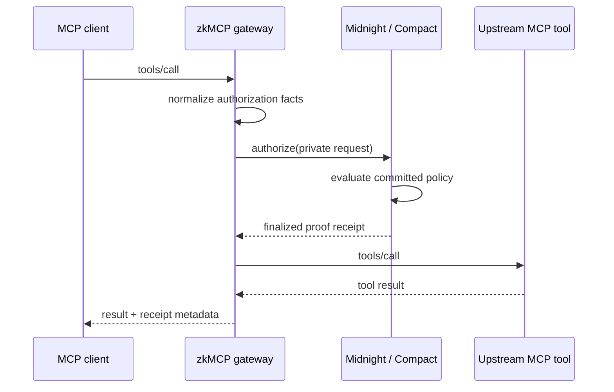

## 1. Start Midnight and deploy the contract

```bash
npm run setup:midnight
```

This starts the local Midnight node, indexer, and proof server, compiles `authorization.compact`, and deploys the current private-policy contract.

## 2. Run the real MCP integration demo

```bash
npm run demo:gateway
```

The demo drives eight real MCP scenarios through the gateway:

```text
ALLOW  assigned matter document
DENY   unrelated matter document
DENY   external email without approval
ALLOW  external email with approval
ALLOW  payment below private threshold
DENY   payment that needs approval
ALLOW  payment with human approval
DENY   payment above private maximum
```

Authorized cases generate Midnight proofs and transactions before the upstream MCP handler runs. Denied cases stop before the upstream handler is invoked.

## 3. Open the docs playground with live proving

```bash
npm run demo:ui
```

Open `http://localhost:4545/docs/playground`.

The documentation site works without the live backend by showing receipts from the final 29 August verification run. `npm run demo:ui` additionally exposes the local demo bridge so the playground can generate fresh proofs.

## 4. Shut down the local chain

```bash
npm run stop:midnight
```

## What happens during an allowed request


