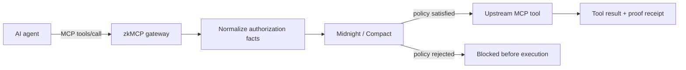

# zkMCP

zkMCP is a **zero-knowledge authorization gateway for Model Context Protocol tools**. It intercepts sensitive `tools/call` requests, proves that the requested action satisfies a committed private policy using Midnight and Compact, and forwards the call only after authorization succeeds.

The central distinction is simple:

- **Access** means an agent can reach a service.
- **Intent** means the model wants to take an action.
- **Authority** means that specific action is permitted under the user's rules.

zkMCP is about the third.



## What is implemented

The current hackathon prototype has a working end-to-end path:

1. A real MCP client calls a real MCP server through zkMCP.
2. `tools/list` is proxied from the upstream server.
3. `tools/call` is normalized into deterministic authorization facts.
4. A Compact contract evaluates the request against a private committed policy.
5. Authorized actions generate and verify a Midnight proof and finalize an authorization transaction.
6. Only then does zkMCP invoke the upstream MCP tool.
7. Denied actions return an MCP error result and never call the upstream handler.

Three authorization classes are demonstrated today:

| Tool | Private rule |
| --- | --- |
| `documents.read` | requested matter must match the agent's authorized resource |
| `email.send` | external send requires trusted human approval |
| `payments.transfer` | amount must stay below a private maximum; higher values can require approval |

## What the verifier learns

A successful authorization exposes a compact public receipt:

```text
policyCommitment
executionCommitment
nullifier
transactionId
blockHeight
contractAddress
network
proofDurationMs
```

It does **not** publish the raw policy, payment amount, resource identifier, approval threshold, prompt, nonce, or arbitrary tool arguments.

## What zkMCP does not prove

zkMCP does not attempt to prove that an LLM reasoned correctly, that its prompt was trustworthy, or that its output was factually correct. It proves a smaller deterministic statement surrounding the model:

> **This requested action satisfied the committed authorization policy.**

That boundary is what makes the system practical.

## Start here

- [Quickstart](/docs/getting-started/quickstart) — run the repository locally.
- [Authorization lifecycle](/docs/concepts/authorization-lifecycle) — understand the full request path.
- [Playground](/docs/playground) — inspect real recorded receipts or run a live local proof.
- [Privacy model](/docs/security/privacy-model) — see exactly which values are private and public.
- [HTTP demo API](/api-reference) — Scalar reference for the local playground bridge.
