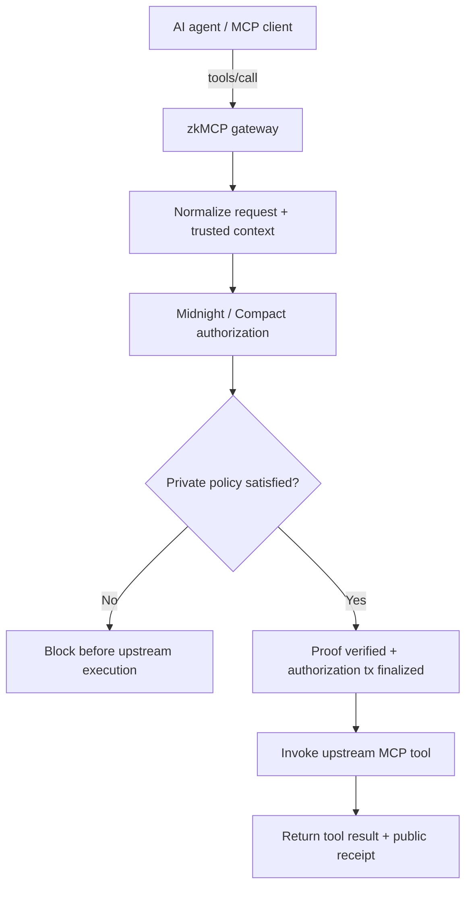

zkMCP sits between an **MCP client** and an **existing MCP tool server**. Sensitive `tools/call` requests are reduced into deterministic authorization facts, evaluated against a private committed policy with Midnight/Compact, and forwarded upstream only after authorization succeeds.



## The problem zkMCP solves

Connecting an agent to a tool establishes **access**, not authority over every possible side effect.

| Layer | Question | Example |
| --- | --- | --- |
| Access | Can the application reach this service? | the agent can connect to a payments MCP server |
| Intent | What does the model want to do? | transfer £2,750 |
| Authority | Is this exact action permitted? | amount is within the private limit and any required approval is valid |

zkMCP is focused on the third question.

This lets an integration express boundaries such as:

```text
documents.read
  → only the assigned private resource

email.send
  → requires trusted human approval

payments.transfer
  → private hard maximum
  → private approval threshold
```

## What is implemented

The current repository has a real end-to-end MCP + Midnight path.

<Cards>
  <Card title="MCP gateway" href="/docs/mcp">
    A real MCP server/client proxy intercepts `tools/call`, proxies `tools/list`, and invokes upstream tools only after authorization.
  </Card>
  <Card title="Compact authorization contract" href="/docs/midnight/compact-contract">
    A private policy is bound to an immutable public commitment and evaluated through tool-specific zero-knowledge constraints.
  </Card>
  <Card title="Proof receipts" href="/docs/architecture/state-and-commitments">
    Successful actions expose commitments, a nullifier, transaction ID, and block state without publishing the raw policy/request.
  </Card>
  <Card title="Interactive playground" href="/docs/playground">
    Inspect the verified Phase 2 scenarios in recorded mode or generate fresh local proofs when the Midnight stack is running.
  </Card>
</Cards>

## Enforcement model

The critical ordering is:

```text
receive request
    ↓
normalize + trusted context
    ↓
private policy authorization
    ↓
proof verification + transaction finalization
    ↓
upstream MCP execution
```

A policy denial, replay, malformed request, unavailable prover, or unavailable Midnight contract all stop before the upstream tool handler.

The gateway does not “execute and then write an audit proof.” The proof-backed authorization is a prerequisite for execution.

## Privacy model at a glance

A successful authorization intentionally exposes a small public receipt:

```text
policyCommitment
executionCommitment
nullifier
transactionId
blockHeight
contractAddress
network
```

The current ledger does **not** directly publish:

```text
policy secret
allowed agent
allowed resource
private maximum
approval threshold
requested amount
approval token
nonce
prompt
arbitrary tool arguments
```

Private policy denials are also surfaced generically as `policy.AUTHORIZATION_DENIED` so the caller cannot learn which hidden constraint failed.

## What zkMCP proves

zkMCP does **not** prove that the LLM reasoned correctly, that its prompt was trustworthy, or that an upstream tool implementation is correct.

The statement is deliberately smaller:

> **This concrete action request satisfied the committed authorization policy before the gateway invoked the protected MCP tool.**

That boundary keeps the probabilistic model outside the security proof while making the side-effect decision deterministic and verifiable.

## Where to go next

<Cards>
  <Card title="Quickstart" href="/docs/getting-started/quickstart">
    Run the local Midnight stack and documentation playground.
  </Card>
  <Card title="Architecture" href="/docs/architecture">
    Understand the request lifecycle, trust boundaries, commitments, failure semantics, deployment, and latency model.
  </Card>
  <Card title="MCP integration" href="/docs/mcp">
    Learn how zkMCP wraps an existing MCP server and how to design normalizers and trusted context.
  </Card>
  <Card title="Security" href="/docs/security">
    Review exactly what is trusted, private, public, logged, and outside the current proof guarantee.
  </Card>
</Cards>
