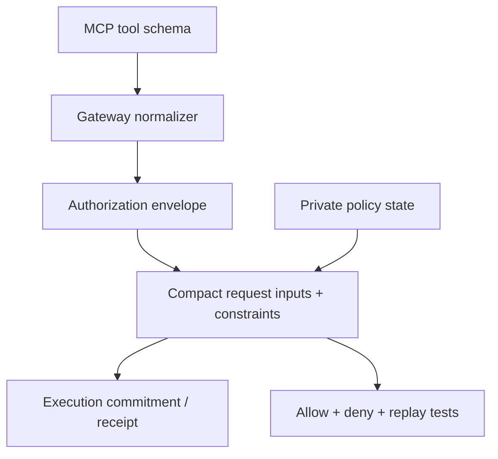

Adding a protected MCP tool is not just a routing change. You are extending the **security statement** that zkMCP proves.

A correct integration therefore touches three layers together:



If a field matters to authority but is omitted from the normalizer or circuit, the proof does not cover that field.

## Example capability

Suppose an upstream MCP server exposes:

```text
deploy.production
```

with arguments:

```json
{
  "repository": "acme/api",
  "environment": "production",
  "ref": "sha-abc123"
}
```

Assume the desired private rule is:

```text
agent must be authorized
AND tool must be deploy.production
AND repository must be in the private allowed scope
AND trusted human approval must be present
```

The following sections show the extension points. The exact `deploy.production` code is illustrative; the repository currently implements the document/email/payment classes described elsewhere.

## 1. Decide the authorization facts

Do not start with Compact syntax. Start by writing the authority statement in application terms.

For this example:

```text
principal
capability
target repository
trusted approval
```

`ref` matters to the deployment application but is not part of the proposed policy above.

If deploying a specific commit is security-sensitive, then `ref` must also become an authorization fact. This decision is the security review.

## 2. Define deterministic representation

The current gateway/Midnight boundary supports:

```ts
interface MidnightAuthorizationRequest {
  agent: string;
  tool: string;
  resource?: string;
  amount?: bigint;
  approved?: boolean;
}
```

A first repository-scoped deployment rule could reuse `resource`:

```ts
{
  agent: configuredAgentId,
  tool: "deploy.production",
  resource: args.repository,
  approved
}
```

This works only if “resource” has the same intended semantics. If the new policy needs two independent resource dimensions, expand the authorization envelope explicitly rather than overloading one field ambiguously.

## 3. Add gateway validation and normalization

`packages/gateway/src/normalize.ts` is the current extension point.

A normalizer should:

1. validate required security-relevant arguments;
2. derive trusted context through verifiers rather than tool fields;
3. create the authorization object;
4. preserve original application arguments separately for upstream forwarding.

Conceptually:

```ts
if (input.tool === "deploy.production") {
  const parsed = deploymentArgumentsSchema.parse(forwardArguments);

  return {
    authorization: {
      agent: input.agentId,
      tool: input.tool,
      resource: parsed.repository,
      approved,
    },
    forwardArguments,
  };
}
```

The normalizer should fail closed if a security-critical field is malformed.

## 4. Extend private policy state

The current private `Policy` struct contains explicit capability fields. A new tool class may require new policy fields such as:

```text
deployTool: Bytes<32>
allowedRepository: Bytes<32>
```

If the existing `allowedResource` is intended to cover only legal matters, reusing it for repositories would couple unrelated policy classes. Prefer explicit state until a well-designed generalized policy representation exists.

The TypeScript private-state loader must also:

- build the new policy field;
- persist/restore it;
- validate fixed widths/ranges;
- migrate or version stored policy state if the schema changes.

The current repository already versions stored policy data (`version: 2`) for this reason.

## 5. Bind new fields into `hashPolicy`

Any private rule that should be fixed by the deployment policy must be included in the policy commitment.

If `allowedRepository` is added to the policy but not to `hashPolicy`, a prover could change that private value without changing the public policy commitment.

Therefore the new field must be part of:

```text
persistentHash(
  policy domain,
  ...all committed policy fields...
)
```

This is a security-critical step.

## 6. Add the Compact tool branch

The circuit needs to recognize the tool digest and enforce the rule:

```text
isDeployProduction = requestTool == policy.deployTool
```

and:

```text
if isDeployProduction:
  assert(requestResource == policy.allowedRepository)
  assert(approved)
```

The common agent, policy-binding, known-tool, and replay rules should continue to apply.

## 7. Bind new request facts into the execution commitment

If a new request field is security-relevant, successful receipts should bind to it.

For the repository-only example, `requestResource` is already included in the current execution commitment.

If you add something new such as:

```text
requestEnvironment
requestRef
```

then update `hashExecution()` as well. Otherwise the circuit might constrain a value that the execution commitment does not cryptographically bind into the public receipt.

## 8. Add trusted context correctly

If production deployment requires approval, do not accept:

```json
{
  "approved": true
}
```

Use the same trusted metadata/verifier pattern or a stronger signed capability.

A deployment-specific approval should ideally be scoped to:

```text
repository
environment
ref / change identifier
agent
expiry
```

rather than one global boolean.

## 9. Test allow and deny paths

At minimum, add tests for:

```text
ALLOW  authorized repository + approval
DENY   wrong repository
DENY   approval absent
DENY   wrong agent
DENY   unknown/uncommitted tool
DENY   replayed authorization
```

The gateway test should also assert that the upstream handler counter does not increment for every deny case.

For ZK coverage, run the real Midnight suite and verify successful cases produce `/prove` traffic and finalized transactions.

## 10. Test privacy separately

Search generated evlog files and public receipts for the new private values.

If the repository identifier is intended to remain private, it must not suddenly appear in:

```text
logs
public error codes
receipt fields
transaction metadata you add yourself
analytics
```

Zero-knowledge privacy is easy to defeat at the application layer.

## Extension checklist

Before considering a new tool protected, answer every item:

- [ ] What exact application facts determine authority?
- [ ] Which facts come from the agent and which come from trusted context?
- [ ] Are security-critical arguments validated before proving?
- [ ] Are new private policy fields bound into `hashPolicy`?
- [ ] Are new request facts constrained by Compact?
- [ ] Are receipt-relevant facts bound into `hashExecution`?
- [ ] Do unknown/invalid variants fail closed?
- [ ] Do denied calls avoid the upstream handler entirely?
- [ ] Are replay semantics correct?
- [ ] Are private values absent from logs/public errors/receipts?
- [ ] Is the documentation explicit about fields that are **not** constrained?

That last item matters. A proof is only useful when consumers know precisely what statement was proven.
