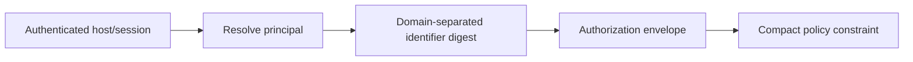

Authorization is meaningless if the requester can simply choose a more privileged identity.

The current zkMCP gateway therefore establishes the principal from configuration rather than ordinary tool arguments:

```ts
const gateway = new ZkMcpGateway({
  agentId: "LegalAgent",
  approvalVerifier,
  authorizer,
  upstream,
});
```

Every normalized authorization request receives that configured `agentId`.

## Current model: one configured principal per gateway

The hackathon prototype effectively models:

```text
one gateway instance
    ↓
one agent principal
    ↓
one committed private policy
```

That is intentionally simple. It is enough to prove that the agent identifier can be constrained privately inside Compact and that an incorrect principal is denied.

The identifier is converted to a fixed-width digest before entering the circuit:

```text
SHA-256("zkmcp:id:v1\0" || agentId)
```

The private policy contains the digest of the allowed principal.

## Why an `agentId` tool argument is not authoritative

This would be unsafe:

```json
{
  "agentId": "AdminAgent",
  "amount": 4500
}
```

The model controls normal tool arguments. Treating that field as the authorization principal would let the requester select its own security identity.

Instead, identity must be established by the host/gateway trust boundary.

## Production identity sources

A multi-agent deployment can derive the principal from stronger sources such as:

- an authenticated MCP session;
- a client certificate or service identity;
- a signed agent credential;
- an OAuth/OIDC subject established by the host;
- a workload identity from the execution platform;
- a delegated capability presented by another authorized principal.

The result still needs to become a deterministic value in the authorization envelope.



## Identity vs model instance

A useful principal does not have to equal one LLM process.

Possible identity scopes include:

```text
one agent process
one named workflow
one application deployment
one service account
one human + agent session
one delegated task capability
```

The right scope depends on what the policy is trying to constrain.

For example, a production deployment agent might authorize the **deployment service identity**, while individual LLM calls are treated as untrusted planners running inside that service.

## Delegation

A richer authorization protocol will eventually need delegation:

```text
Human / organization authority
        ↓ delegates bounded capability
Primary agent
        ↓ delegates narrower task
Sub-agent
        ↓ requests tool action
zkMCP
```

A safe delegation chain should preserve:

- the root authority;
- the exact delegated scope;
- expiry/freshness;
- maximum delegation depth or explicit policy;
- revocation semantics;
- non-escalation: a child cannot delegate authority it did not receive.

Delegated identities are not implemented in the current contract.

## Identity privacy

The raw configured agent name is not stored as a public ledger field. Compact receives its digest as a private request input, and a successful authorization reveals the execution commitment rather than the raw principal.

That does not make the identity universally anonymous: the gateway process obviously knows which principal it configured. The privacy claim is narrower—**the public authorization receipt does not need to publish the raw agent identifier.**
