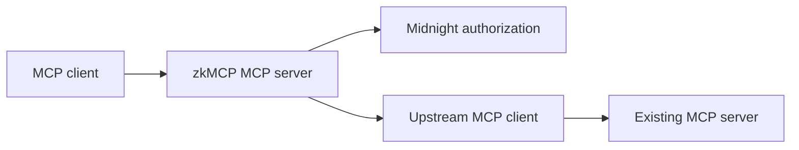

`ZkMcpGateway` exposes a normal MCP server while holding a client connection to the upstream server. This lets an existing tool server stay focused on tool behavior while zkMCP owns the authorization boundary.

The current gateway protects tools. MCP resources and prompts are not yet intercepted.
