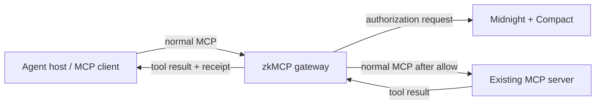

zkMCP is designed to look like a normal MCP server to the agent and a normal MCP client to the upstream tool server.

That makes the gateway a **protocol-compatible authorization proxy**:



The existing server keeps owning tool schemas and business logic. zkMCP owns the pre-execution authorization decision.

## What changes for the agent

From the agent's perspective, very little changes:

```text
before:  agent → existing MCP server
after:   agent → zkMCP → existing MCP server
```

The agent still discovers tools through `tools/list` and calls them through `tools/call`.

A zkMCP-aware client can additionally inspect receipt/error metadata:

```text
io.zkmcp/authorization-receipt
io.zkmcp/authorization-error
```

A client that ignores those metadata extensions can still consume the ordinary MCP content/result shape.

## What changes for the server

In the wrapper topology, the upstream server does not need to embed Midnight logic.

The gateway holds an MCP client connection to that server and forwards calls only after authorization succeeds.

The main integration work is therefore **normalization**: deciding which application arguments and trusted context become the deterministic facts used by the policy circuit.

## What is transparent

`tools/list` is proxied from the upstream server. zkMCP does not maintain a second hand-written catalog of the upstream tools.

The gateway also records upstream output schemas so the MCP SDK can project `tools/call` responses correctly.

## What is intercepted

`tools/call` is the current enforcement point.

```text
MCP request
  ↓
normalize authorization facts
  ↓
resolve trusted metadata
  ↓
Midnight authorize
  ├─ denied → MCP isError, no upstream call
  └─ allowed → upstream call → attach proof receipt
```

The current prototype protects **tools**, not MCP resources or prompt retrieval. Extending the same model to other MCP primitives would require defining the corresponding deterministic authorization envelope and interception point.

## Integration checklist

A real integration needs five decisions:

1. **Where does the gateway run?** Local wrapper, shared sidecar, or embedded authorization.
2. **How is the agent principal established?** Static configuration today; authenticated identity later.
3. **Which tool arguments matter to policy?** Define a normalizer for each protected capability class.
4. **Which facts are trusted context?** Human approval, organization identity, delegated scope, and similar claims must not come from ordinary model-controlled arguments.
5. **Can the agent bypass the gateway?** The upstream execution path must be inaccessible or separately restricted if zkMCP is meant to enforce authority rather than merely record it.

<Cards>
  <Card title="Wrap an existing MCP server" href="/docs/mcp/wrapping-a-server">
    See the current low-level gateway composition and where the upstream MCP client fits.
  </Card>
  <Card title="Integration patterns" href="/docs/mcp/integration-patterns">
    Compare local proxy, shared sidecar, and embedded authorization approaches.
  </Card>
  <Card title="tools/call" href="/docs/mcp/tools-call">
    Inspect the exact protected execution path and receipt behavior.
  </Card>
  <Card title="Trusted metadata" href="/docs/mcp/trusted-metadata">
    Keep approval and other privileged claims outside model-controlled arguments.
  </Card>
</Cards>
