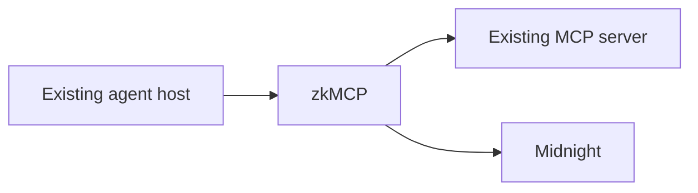
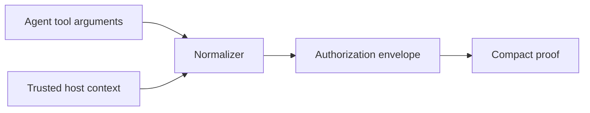

zkMCP does not require one agent framework or one MCP transport. What matters is that sensitive execution is routed through a boundary that can establish identity, derive authorization facts, prove policy satisfaction, and fail closed.

## Pattern 1: protect an existing server without changing it

Use the gateway as a protocol proxy:



This is the strongest fit for the current `ZkMcpGateway` implementation.

**You change:**

- the MCP endpoint/process the agent connects to;
- gateway agent identity configuration;
- tool normalization rules;
- approval verifier configuration.

**You do not change:**

- upstream tool schemas;
- upstream tool handler implementations;
- ordinary MCP result payloads.

## Pattern 2: protect only high-risk tools

An MCP server may expose both low-risk and high-risk capabilities. A future generalized gateway can classify only selected tools as proof-required.

For the current prototype, every tool still goes through Midnight and unknown tools fail closed. That behavior is intentionally safer than an implicit bypass.

A production policy layer could make protection explicit:

```text
filesystem.search        ordinary access policy
repository.read          ordinary access policy
repository.write         zkMCP authorization
deploy.production        zkMCP + human approval
payments.transfer        zkMCP + private numeric limit
```

The key rule is that “unprotected” must be an explicit policy decision, never the fallback for a missing normalizer.

## Pattern 3: use trusted context from the host

The agent should not be able to write every fact that determines authority.

Host or gateway context can supply facts such as:

```text
principal identity
organization membership
human approval
session scope
delegation chain
environment
request origin
```

Those values can then be combined with agent-controlled tool arguments during normalization.



The current demo implements this pattern for human approval.

## Pattern 4: use a domain-specific normalizer

The strongest authorization statements are usually domain-aware.

A legal document server may normalize:

```text
matterId → resource scope
```

A deployment server may normalize:

```text
environment + repository + operation → deployment authority
```

A payment server may normalize:

```text
amount + currency + recipient class → financial authority
```

This is better than a universal `hash(JSON.stringify(args))` approach because the circuit can constrain the actual business property rather than merely bind to opaque bytes.

## Pattern 5: human-in-the-loop escalation

The policy can require trusted approval only for actions above some risk threshold.

Example:

```text
payment < £4,000                  allow without approval
£4,000 ≤ payment ≤ £5,000        require approval
payment > £5,000                 deny even with approval
```

The threshold values can remain private while the resulting authorization is public/verifiable.

This pattern generalizes to:

```text
external recipient → require approval
production deploy   → require approval
sensitive dataset   → require approval
high-risk operation → require approval
```

## Pattern 6: receipt-aware agent host

A host can treat the zkMCP receipt as additional execution evidence.

For example, after `tools/call` returns:

```ts
const receipt = result._meta?.["io.zkmcp/authorization-receipt"];
```

A receipt-aware host could:

- show the policy commitment in an audit UI;
- attach the receipt to a workflow trace;
- correlate the transaction with enterprise logs;
- require a receipt before marking a high-risk step complete;
- later verify an opened execution commitment against disclosed audit data.

The current gateway already attaches the receipt. These richer consumer workflows are future integration work.

## Pattern 7: policy templates by capability class

Rather than giving developers raw circuits for every tool, a future SDK can expose reusable authorization primitives:

```text
resourceMembership(...)
privateMaximum(...)
requiresApproval(...)
allowedOperation(...)
expiresAt(...)
```

A tool integration would map application-specific arguments to those primitives.

That is the direction for a policy DSL, but the hackathon implementation deliberately keeps the actual Compact constraints visible instead of pretending that higher-level SDK already exists.

## Adoption sequence

For a new MCP server, the safest incremental path is:

1. choose one genuinely sensitive `tools/call` capability;
2. identify the minimum facts that determine authority;
3. decide which facts are agent-controlled versus trusted context;
4. add a normalizer;
5. encode the corresponding private Compact constraints;
6. verify denial occurs before the upstream handler;
7. expose and store proof receipts;
8. add more capabilities only after the boundary is well understood.

This keeps integration work security-driven rather than turning zkMCP into a generic proxy with unclear policy semantics.
