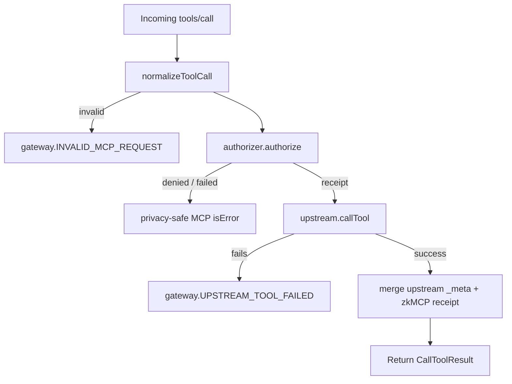

`tools/call` is the current zkMCP enforcement point.

The gateway installs its handler on the MCP server it exposes to the agent:

```ts
mcp.server.setRequestHandler("tools/call", async (request) => {
  const result = await handleToolCall({
    name: request.params.name,
    arguments: request.params.arguments,
    meta: request.params._meta,
  });

  return mcp.server.projectCallToolResult(
    result,
    outputSchemas.get(request.params.name)
  );
});
```

The important behavior is inside `handleToolCall()`.

## Execution order



There is no upstream execution branch before `authorizer.authorize()` returns successfully.

## Original arguments vs authorization facts

The gateway keeps two representations of the same requested action:

```ts
interface NormalizedToolCall {
  authorization: MidnightAuthorizationRequest;
  forwardArguments: Record<string, unknown>;
}
```

`authorization` is the deterministic, minimal proof statement.

`forwardArguments` preserves the original application payload for the real tool.

Example payment request:

```json
{
  "amount": 2750,
  "recipient": "client-settlement-account",
  "memo": "Thompson settlement disbursement"
}
```

Current authorization facts:

```ts
{
  agent: "LegalAgent",
  tool: "payments.transfer",
  amount: 2750n,
  approved: false
}
```

The `recipient` and `memo` are still forwarded after authorization, but the current payment policy does not constrain them.

That distinction is important when evaluating the security coverage of a normalizer: **a field omitted from the authorization envelope is not protected by the Compact policy merely because it exists in the upstream request.**

## Receipt metadata

Successful calls add:

```text
io.zkmcp/authorization-receipt
```

without discarding existing upstream metadata:

```ts
return {
  ...upstreamResult,
  _meta: {
    ...upstreamResult._meta,
    [ZKMCP_RECEIPT_META_KEY]: receipt,
  },
};
```

The receipt includes public commitment/transaction data, not the raw private policy or tool arguments.

## Error metadata

Blocked calls return `isError: true` and attach:

```text
io.zkmcp/authorization-error
```

Private policy failures are collapsed to a generic public code:

```text
policy.AUTHORIZATION_DENIED
```

This prevents callers from probing the policy by repeatedly submitting near-boundary requests and reading detailed failure labels.

## Output schema projection

The MCP SDK can project tool results according to an output schema. Because zkMCP does not own the upstream tool definitions, it records output schemas observed during `tools/list` and uses the matching schema when returning a proxied call result.

This is a small implementation detail, but it is part of staying protocol-compatible instead of inventing a parallel tool catalog.

## Unknown tools

Unknown tool names are not locally allowed by default.

The normalizer produces an authorization envelope with the requested tool and sends it to Midnight. The Compact policy only recognizes committed tool digests, so an unrecognized tool is rejected.

This is intentionally fail-closed.

## Side-effect semantics

A successful authorization means:

> The gateway was permitted to invoke the requested tool under the committed policy.

It does not mean the upstream call must succeed. If the tool fails after authorization, the receipt still records a valid authorization attempt and the gateway returns `gateway.UPSTREAM_TOOL_FAILED`.

For non-idempotent tools such as payments or external sends, callers need application-level idempotency before retrying a post-authorization upstream failure.

See [Request lifecycle](/docs/architecture/request-lifecycle) for the complete cross-layer path.
