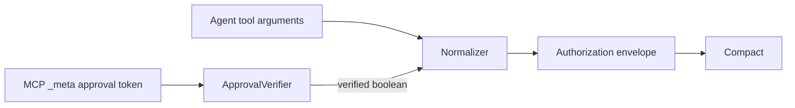

Some facts that determine authority must not be writable by the model.

Human approval is the clearest example. An agent that needs approval must not be able to authorize itself by producing:

```json
{
  "approved": true
}
```

zkMCP therefore separates **application arguments** from **trusted authorization context**.

## Current approval metadata

The demo uses the MCP request metadata key:

```text
io.zkmcp/approval-token
```

The gateway extracts the token from `_meta` and passes it to an `ApprovalVerifier`:

```ts
export interface ApprovalRequest {
  token?: string;
  tool: string;
}

export interface ApprovalVerifier {
  isApproved(
    request: ApprovalRequest
  ): boolean | Promise<boolean>;
}
```

Only the verifier's result becomes the private `approved` boolean supplied to Compact.



## Current verifier implementations

### `DenyAllApprovalVerifier`

Always returns `false`.

Use it when an integration has no trusted approval source and the policy should never receive an approval signal.

### `FixedTokenApprovalVerifier`

The hackathon demo accepts one configured local token.

The verifier stores a SHA-256 digest of the configured token and compares incoming digests using Node's `timingSafeEqual()`.

This avoids a trivial string-comparison timing leak, but the **authorization model is still only a demo** because the token is:

- static;
- not scoped to one action;
- not expiring;
- not signed by a human identity;
- not bound to a recipient, amount, resource, or execution commitment.

## What production approval should bind

A production approval capability should normally include or commit to:

```text
approver identity
agent / delegate identity
tool or operation class
resource or recipient scope
maximum amount or exact amount
expiry
nonce / replay state
policy or organization context
```

A signed approval might conceptually say:

```text
Approver X authorizes agent A
to call payments.transfer
for up to £4,500
to recipient class R
before 2026-08-29T18:00Z
under policy P.
```

The gateway would verify that capability and then pass only the necessary deterministic facts into the Compact authorization statement.

## Metadata is a transport, not automatically trust

Putting a value in MCP `_meta` does not make it trusted by itself.

Trust comes from the verifier and the path by which the host created the metadata.

For example, this would still be unsafe if the same agent can freely set arbitrary `_meta` values on its request and the verifier merely checks that a string is present.

A deployment needs a protected channel or credential that the agent cannot forge.

## Other trusted context

The same separation can be used for more than human approval:

- authenticated organization ID;
- deployment environment;
- user session subject;
- delegated capability;
- data-classification clearance;
- rate/risk tier;
- approved change ticket;
- human role or signing authority.

Those values should be resolved at the gateway/host boundary, then normalized together with application arguments.

## Privacy considerations

Trusted metadata may itself be sensitive.

The current logging policy deliberately excludes fields such as approval tokens and arbitrary authorization context. If an approval claim must be represented publicly, prefer a commitment or scoped identifier instead of emitting the raw credential.

See [Trust boundaries](/docs/architecture/trust-boundaries) for the complete source-of-truth model.
