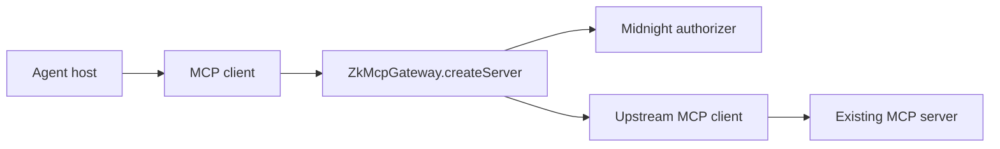

The current API is intentionally explicit. There is no published `wrapServer()` convenience helper yet; the repository composes the gateway from the exact dependencies that define the trust boundary.

## 1. Create the Midnight authorizer

```ts
import { createMidnightAuthorizationClient } from "@zkmcp/midnight";

const authorizer = await createMidnightAuthorizationClient();
```

The client connects to the configured Midnight deployment, restores or creates wallet state, loads the local private policy witness, and exposes:

```ts
await authorizer.authorize({
  agent: "LegalAgent",
  tool: "payments.transfer",
  amount: 2750n,
  approved: false,
});
```

## 2. Choose an approval verifier

The prototype ships two verifier implementations:

```ts
import {
  DenyAllApprovalVerifier,
  FixedTokenApprovalVerifier,
} from "@zkmcp/gateway/approval";
```

For tools that never use human approval, `DenyAllApprovalVerifier` is a safe default.

The fixed-token verifier exists for the local demo. It uses a SHA-256 digest and constant-time comparison, but the token itself is still only a development mechanism.

## 3. Connect an MCP client to the upstream server

Your upstream connection remains a normal MCP client. The gateway only requires this interface:

```ts
interface GatewayUpstreamClient {
  listTools(input?: { cursor?: string }): Promise<ListToolsResult>;
  callTool(input: {
    name: string;
    arguments?: Record<string, unknown>;
  }): Promise<CallToolResult>;
  close?(): Promise<void>;
}
```

That means the transport can be stdio, HTTP, an in-memory test transport, or another MCP transport supported by the host/client SDK.

## 4. Construct the gateway

```ts
import { ZkMcpGateway } from "@zkmcp/gateway";

const gateway = new ZkMcpGateway({
  agentId: "LegalAgent",
  approvalVerifier,
  authorizer,
  upstream: {
    listTools: (input) => upstreamClient.listTools(input),
    callTool: (input) => upstreamClient.callTool(input),
    close: () => upstreamClient.close(),
  },
});
```

The configured `agentId` is part of the authorization principal. The model does not select this value in its tool payload.

## 5. Expose the protected server

```ts
const protectedServer = gateway.createServer();
await protectedServer.connect(gatewayTransport);
```

The agent connects to `protectedServer`, not directly to the upstream server.



## 6. Close resources together

The gateway can close both the authorization backend and upstream client:

```ts
await gateway.close();
```

The demo runtime additionally closes the agent-side client and upstream server so the entire topology shuts down cleanly.

## Stdio example topology

A local agent host commonly launches an MCP server as a subprocess over stdio. zkMCP can occupy that subprocess slot:

```text
Agent host
  │ stdio
  ▼
zkMCP gateway process
  │ stdio / in-memory / remote MCP transport
  ▼
Existing MCP server
```

The repository's Phase 2 end-to-end demo validated a real stdio chain with the MCP v2 TypeScript SDK.

One compatibility detail discovered during the build: nested stdio clients using the SDK's `auto` version-negotiation probing stalled before `initialize`, so the verified demo uses explicit legacy/2025 negotiation mode while still using the current v2 packages.

## Enforcement requirement

Wrapping a server only creates a security boundary if the protected client cannot bypass it.

Bad deployment:

```text
agent ───────────────→ upstream MCP server
  └→ zkMCP → upstream MCP server
```

The direct route makes zkMCP optional.

Enforced deployment:

```text
agent → zkMCP → upstream MCP server
              ↑
        only trusted route
```

Use network isolation, process boundaries, credentials, or upstream access controls so the gateway-mediated path is the path with authority.

## Current package status

The import paths shown here refer to monorepo workspace packages. They are working packages inside this repository but are **not published to npm yet**.

The natural productization step is to make this composition simpler without hiding the boundaries that matter for security.
