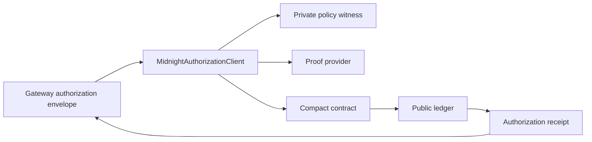

Midnight is not used to prove the AI model. It proves the deterministic authorization statement surrounding the model's requested side effect.

`@zkmcp/midnight` is the adapter that turns a normalized request into a proof-backed authorization transaction and then returns a compact public receipt to the MCP gateway.



## Package responsibilities

The current package owns:

- wallet setup and synchronization;
- local private policy loading and validation;
- identifier digesting;
- private-state provider configuration;
- proof-server configuration;
- contract binding/connection;
- fresh nonce generation;
- authorization call serialization;
- proof-backed transaction submission;
- public ledger readback;
- receipt construction;
- typed Midnight/proof/replay error translation;
- privacy-safe evlog events.

## What the Compact layer proves

Every request shares common constraints:

```text
private policy hashes to the deployment commitment
request agent matches the allowed agent
request tool matches a committed capability
nullifier is fresh
```

Then the tool branch adds its own rule:

```text
documents.read     → resource matches private scope
email.send         → trusted approval is true
payments.transfer  → amount <= private hard maximum
                     and threshold approval rule passes
```

The exact fields and current coverage gaps are documented in [Circuit constraints](/docs/midnight/circuit-constraints).

## Private vs public

The policy, request amount, resource, approval state, and nonce can remain private circuit inputs.

The ledger deliberately exposes commitments and replay state:

```text
policyCommitment
executionCommitment
nullifier
usedNullifiers
authorizationCount
```

The TypeScript receipt then adds transaction metadata such as block height and transaction ID.

## Runtime stack

The validated local environment combines:

```text
Midnight node
Indexer
Proof server
Wallet SDK
Level private-state provider
Compiled Compact assets
```

See [Runtime stack](/docs/midnight/runtime-stack) for the provider topology and local services.

## Read in order

<Cards>
  <Card title="Runtime stack" href="/docs/midnight/runtime-stack">
    Understand the providers, wallet, proof server, node, indexer, and private-state storage.
  </Card>
  <Card title="Compact contract" href="/docs/midnight/compact-contract">
    Inspect the private policy struct, public ledger, commitment functions, and authorize circuit.
  </Card>
  <Card title="Circuit constraints" href="/docs/midnight/circuit-constraints">
    See the exact predicate each demo tool proves and which application fields are not yet covered.
  </Card>
  <Card title="Proof lifecycle" href="/docs/midnight/proof-lifecycle">
    Follow one request through witness resolution, proving, finalization, ledger query, and receipt construction.
  </Card>
</Cards>
