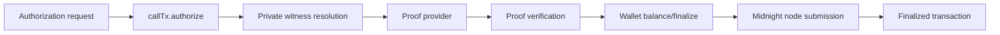

The gateway never constructs Midnight transactions directly. It calls:

```ts
const receipt = await authorizer.authorize(request);
```

`MidnightAuthorizationClient` owns the proof/transaction lifecycle behind that method.

## Connected client state

A connected client holds:

```text
contractAddress
network
policyCommitment
wallet context
Midnight.js providers
deployed contract binding
authorization queue tail
```

The public `policyCommitment` is read from the deployed ledger during connection so later logs/receipts can identify which policy deployment authorized the action.

## Step 1: serialize on the current client

The prototype uses an `authorizationTail` promise so one client instance authorizes one request at a time.

```text
request A → authorizeSerial
request B → waits for A → authorizeSerial
request C → waits for B → authorizeSerial
```

This is an implementation safety choice around the current wallet/private-state path, not a cryptographic requirement of zkMCP.

## Step 2: create a fresh nonce

Each request receives a random 32-byte nonce:

```text
randomBytes(32)
```

The nonce is supplied privately to Compact and contributes to both the execution commitment and nullifier.

## Step 3: digest identifiers

Textual values become fixed-size `Bytes<32>` values:

```text
identifierDigest(agent)
identifierDigest(tool)
identifierDigest(resource ?? "")
```

The digest is domain-separated SHA-256 using `zkmcp:id:v1`.

## Step 4: call the deployed Compact circuit

The client invokes:

```text
deployed.callTx.authorize(
  requestAgentDigest,
  requestToolDigest,
  requestResourceDigest,
  requestAmount,
  approved,
  nonce
)
```

Midnight.js constructs the contract call, resolves private witness state, obtains the proof, balances/signs the transaction, submits it, and returns finalized public transaction information.



## Step 5: query ledger state

After the call completes, the client queries the contract through the public-data/indexer provider and decodes the authorization ledger.

The current receipt reads:

```text
ledger.lastExecutionCommitment
ledger.lastNullifier
ledger.policyCommitment
```

plus transaction metadata returned by Midnight.js.

## Step 6: construct the application receipt

```ts
interface MidnightAuthorizationReceipt {
  blockHeight: number;
  contractAddress: string;
  executionCommitment: string;
  network: NetworkId;
  nullifier: string;
  policyCommitment: string;
  proofDurationMs: number;
  transactionId: string;
}
```

`proofDurationMs` currently measures the broader authorization operation around `callTx.authorize`, not isolated prover CPU time.

## Step 7: emit privacy-safe observability

On success, evlog receives only receipt-safe fields such as:

```text
policy commitment
execution commitment
nullifier
proof duration
transaction id
block height
```

On a private policy denial, the detailed Compact assertion is translated into generic `policy.AUTHORIZATION_DENIED` metadata before logging/public return.

## Failure classification

The client maps low-level failures into typed zkMCP errors.

Examples:

```text
Compact assertion marker
  → policy.AUTHORIZATION_DENIED

reused nullifier marker
  → replay.NULLIFIER_ALREADY_USED

proof server connection failure
  → proof.SERVER_UNAVAILABLE

other proving failure
  → proof.GENERATION_FAILED

missing indexed contract state
  → midnight.INDEXER_UNAVAILABLE
```

The original error can remain attached internally as a cause, but the public metadata path is intentionally narrower.

## Proof success vs tool success

A successful `authorize()` means the authorization transaction finalized and a receipt was produced.

Only after that does the MCP gateway call the upstream tool.

Therefore there are two different success boundaries:

```text
AUTHORIZATION SUCCESS
proof valid + tx finalized
        ↓
TOOL EXECUTION ATTEMPT
upstream MCP handler runs
        ↓
APPLICATION SUCCESS OR FAILURE
```

This distinction matters for non-idempotent tools. An upstream failure can occur after a valid authorization has already been committed.

## Closing the client

`close()` waits for the authorization queue to drain, persists wallet state where appropriate, and stops the wallet SDK instance.

The gateway's own `close()` method can call both the authorizer and upstream MCP client's close hooks so the wrapper topology shuts down as one unit.
