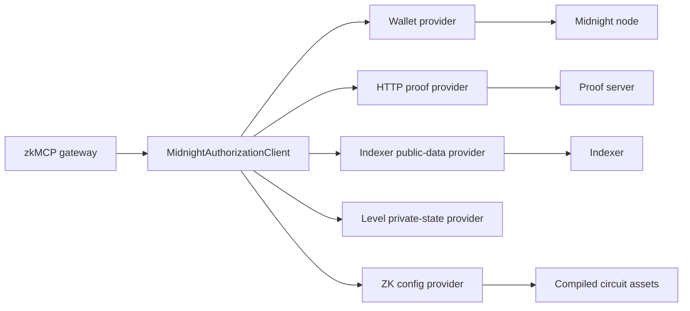

`@zkmcp/midnight` is the adapter between the gateway's deterministic authorization envelope and the Midnight runtime.

It currently combines several Midnight.js providers in one Node.js process:



## Provider composition

The current client creates these providers:

| Provider | Implementation | Responsibility |
| --- | --- | --- |
| proof | `httpClientProofProvider(...)` | sends proving work to the configured Midnight proof server |
| public data | `indexerPublicDataProvider(...)` | queries contract state through the Midnight indexer |
| private state | `levelPrivateStateProvider(...)` | persists witness/private state locally |
| ZK config | `NodeZkConfigProvider(...)` | loads compiled circuit/proving assets |
| wallet | wallet SDK adapter | balances, finalizes, and submits transactions |

The gateway never talks directly to those providers. It depends on the narrower `authorize()` interface exposed by `MidnightAuthorizationClient`.

## Local runtime services

The validated local environment runs three Docker-backed services:

```text
Midnight node    :9944
Indexer          :8088
Proof server     :6300
```

`npm run setup:midnight` starts the stack, compiles the Compact contract, prepares wallet/private state, and deploys the current authorization contract.

## Wallet provider

The wallet adapter supplies the methods Midnight.js needs to balance and submit a transaction.

Conceptually:

```ts
const walletProvider = {
  balanceTx: async (tx, ttl) => {
    const recipe = await wallet.balanceUnboundTransaction(tx, keys, { ttl });
    return wallet.finalizeRecipe(recipe);
  },
  getCoinPublicKey: () => shieldedKeys.coinPublicKey,
  getEncryptionPublicKey: () => shieldedKeys.encryptionPublicKey,
  submitTx: (tx) => wallet.submitTransaction(tx),
};
```

The application does not receive raw signing keys through the authorization receipt.

## Private state provider

The Compact witness needs access to private policy state. The client configures a LevelDB-backed private-state provider under the Midnight package directory.

The storage password comes from:

```text
PRIVATE_STATE_PASSWORD
```

with a local-development placeholder fallback in the prototype.

Production deployments should not use that fallback. Private-state encryption keys belong in a real secret-management boundary.

## ZK configuration

The Compact compiler emits managed contract bindings and circuit assets under the package's managed contract output.

`NodeZkConfigProvider` points Midnight.js at those compiled assets so the proof provider can construct the proving request expected by the deployed contract.

This is why `npm run compile:contracts` is a real quality gate rather than a documentation-only build step.

## Contract connection

`MidnightAuthorizationClient.connect()` performs this sequence:

```text
resolve network
  ↓
load deployment address
  ↓
load/create private policy state
  ↓
load/create wallet seed
  ↓
wait for wallet sync
  ↓
construct providers
  ↓
find deployed Compact contract
  ↓
query public ledger
  ↓
return connected authorization client
```

If the deployment or indexed contract state is unavailable, the client fails closed with typed Midnight errors.

## Local devnet wallet behavior

The `undeployed` network is ephemeral. Restarting the local chain can produce a new chain that is behind a previously persisted wallet synchronization checkpoint.

The client therefore uses:

```text
undeployed → fresh wallet synchronization
preview    → persisted wallet state may be restored
preprod    → persisted wallet state may be restored
```

This avoids the infinite “still syncing” behavior we hit when an old local checkpoint was restored against a newly reset devnet.

## Runtime-version pin

During Phase 0, the Midnight scaffold installed two physical instances of `@midnight-ntwrk/onchain-runtime-v3` through different dependency paths.

The result was a subtle runtime failure:

```text
Error: expected instance of StateValue
```

Compilation, deployment, and state reads could succeed while contract calls failed because `instanceof` checks crossed two WASM/runtime module instances.

The repository currently pins/deduplicates the runtime so Compact runtime and Midnight.js protocol use the same physical version.

This is documented because it is exactly the kind of failure a developer reproducing the stack otherwise spends hours diagnosing.

## Boundary exposed to the gateway

All of this machinery is hidden behind:

```ts
interface GatewayAuthorizationBackend {
  authorize(
    request: MidnightAuthorizationRequest
  ): Promise<MidnightAuthorizationReceipt>;
  close?(): Promise<void>;
}
```

That narrow interface is deliberate. The MCP layer should not need to know whether the authorizer uses a local prover, a remote proving service, a different wallet topology, or a future delegated-capability protocol.
