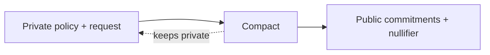

The local witness supplies the private policy to Compact. Request facts are also circuit inputs rather than public ledger fields.

| Value | Local gateway / prover | Compact private input | Public ledger |
| --- | ---: | ---: | ---: |
| policy secret | yes | yes | no |
| allowed agent | yes | yes | no |
| tool identity | yes | yes | no |
| resource identifier | yes | yes | no |
| payment amount | yes | yes | no |
| private maximum | yes | yes | no |
| approval threshold | yes | yes | no |
| approval state | yes | yes | no |
| raw nonce | yes | yes | no |
| policy commitment | yes | yes | yes |
| execution commitment | yes | yes | yes |
| nullifier | yes | yes | yes |

The exact internal proving representation is a Midnight implementation detail. Application code should treat proof-system private result objects as confidential and extract only the receipt fields it needs.
