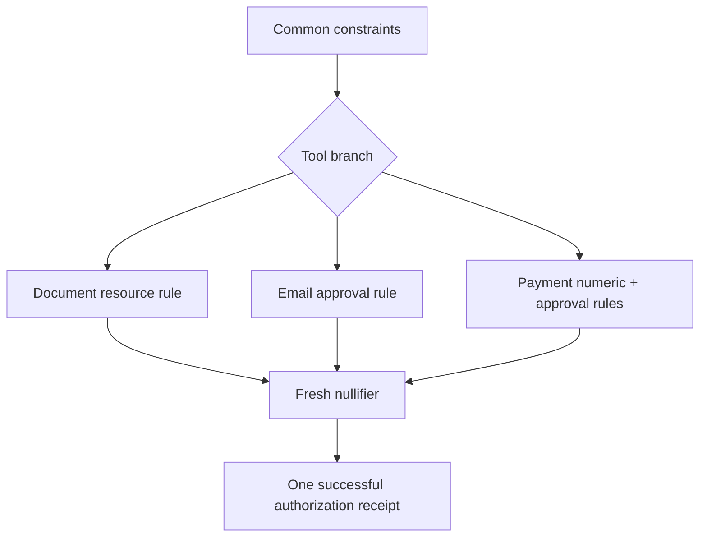

zkMCP does not produce one receipt per individual rule. A successful authorization represents the **combined predicate** for that action.

For a payment request, the statement is approximately:

```text
private policy hashes to the committed policy
AND request agent matches allowed agent
AND request tool matches payments.transfer
AND request amount <= private hard maximum
AND (
  request amount <= private approval threshold
  OR trusted approval is true
)
AND authorization nullifier is fresh
```

If any assertion fails, no successful authorization receipt is committed and the upstream MCP tool is not invoked.

## Common + branch-specific constraints

The current circuit can be viewed as two layers.

### Common layer

Every protected action proves:

```text
policy commitment matches
agent is authorized
requested tool is one of the committed capabilities
nullifier is fresh
```

### Capability layer

Then one branch adds the capability-specific predicate:

```text
documents.read
  → resource membership

email.send
  → trusted approval

payments.transfer
  → private hard maximum
  AND private approval-threshold rule
```



## Why conjunction matters

Imagine evaluating each rule independently and emitting separate claims:

```text
agent is allowed         ✓
amount is below maximum  ✓
approval exists          ✓
```

Those claims are only useful if they all refer to the **same action, policy, principal, and freshness context**.

zkMCP instead builds one execution commitment over the shared request context and proves the relevant assertions in one circuit call.

This reduces ambiguity about whether separate rule checks were mixed across different requests.

## Policy binding is part of the conjunction

The private witness is not free to choose a policy that makes the request pass.

Every authorization includes:

```text
hashPolicy(privatePolicy) == ledger.policyCommitment
```

Therefore the statement is not merely:

> there exists some policy that authorizes this action.

It is:

> the action is authorized by the private policy bound to this deployment commitment.

## Approval cannot override unrelated constraints

Combined predicates make precedence explicit.

For payments:

```text
amount <= max
AND (amount <= threshold OR approved)
```

means approval can satisfy only the threshold condition. It cannot make `amount <= max` true when the amount exceeds the hard maximum.

This avoids ambiguous “admin override” behavior.

## Adding more constraints

Suppose a production payment rule also needs:

```text
recipientClass == clientAccount
currency == GBP
businessHours == true
```

The intended statement becomes:

```text
policy binding
AND agent
AND tool
AND hard maximum
AND approval rule
AND allowed recipient class
AND allowed currency
AND business-hours rule
AND replay protection
```

A successful receipt then means the entire conjunction passed.

## Optional constraints need explicit semantics

Not every fact applies to every capability. The current contract handles this with tool branches.

For a document read:

```text
requestAmount = 0
approved = false
```

can be supplied because the document branch does not depend on payment amount or approval.

The protocol must make this explicit. A default value should never accidentally be interpreted as “constraint passed.”

## Cross-tool policies

More advanced policies may depend on history across actions:

```text
agent may send email only after document review
agent may deploy only after tests pass
agent may transfer only once per approved workflow
```

Those are stateful workflow constraints rather than simple per-action predicates.

They require a clear state model for:

- previous authorized actions;
- workflow identity;
- ordering;
- expiry;
- cancellation;
- replay and partial completion.

The current contract does not implement cross-action workflow state.

## Keep the proof statement legible

A key design principle for zkMCP is that the authorization predicate should remain explainable.

Adding dozens of opaque rules to one circuit can make the system hard to audit even if it remains mathematically valid.

A good policy system should let developers answer:

1. which request facts are constrained;
2. where each fact came from;
3. which constraints are private;
4. what the receipt commits to;
5. what the proof still does not cover.

See [Circuit constraints](/docs/midnight/circuit-constraints) for the exact predicate implemented today.
