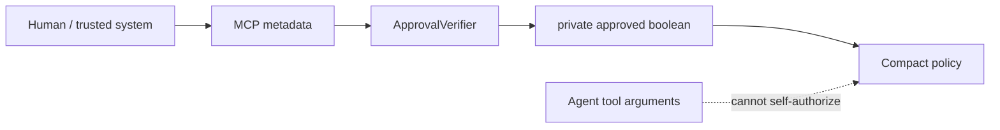

Email authorization currently requires approval. Payment authorization requires approval only above the private threshold.

Approval is resolved by an `ApprovalVerifier` from trusted MCP metadata. Compact receives only the resulting private boolean.

Production approval should be signed and scoped to the action being approved. The fixed token verifier exists only for the local hackathon demonstration.
