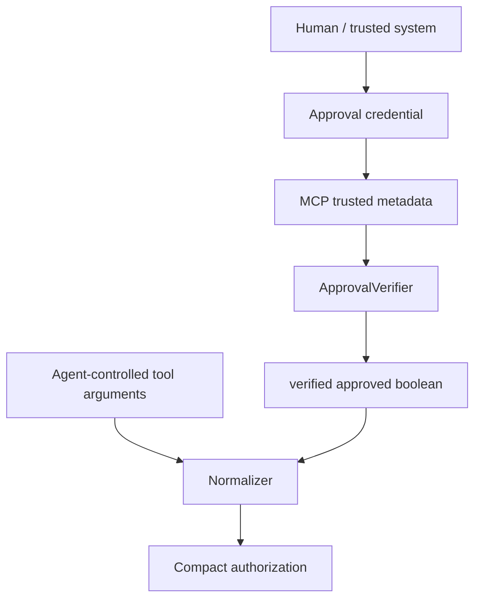

Human approval is only meaningful when the model cannot manufacture the approval signal itself.

For that reason, zkMCP treats approval as **trusted context**, not an ordinary tool argument.

## Unsafe pattern

This must not grant authority:

```json
{
  "to": "outside-counsel@example.com",
  "approved": true
}
```

The model controls the tool payload. If `approved: true` were accepted directly, an agent could satisfy the policy by editing its own request.

## Current trusted path

The demo carries an approval credential in MCP request metadata:

```text
io.zkmcp/approval-token
```

The gateway reads the credential and passes it through an `ApprovalVerifier`:

```ts
interface ApprovalVerifier {
  isApproved(request: {
    token?: string;
    tool: string;
  }): boolean | Promise<boolean>;
}
```

Only the verified result becomes the private boolean supplied to Compact.



## Email policy

The current `email.send` branch requires:

```text
approved == true
```

This demonstrates a capability that is always approval-gated.

Without valid approval:

```text
email.send → policy.AUTHORIZATION_DENIED
upstream email handler → never invoked
```

With valid approval:

```text
email.send → proof-backed authorization → upstream email handler
```

## Payment escalation

Payments use approval conditionally:

```text
amount <= privateApprovalThreshold
OR approved == true
```

This creates an escalation region rather than approval for every payment.

The demo policy is:

```text
amount <= £4,000               no approval required
£4,000 < amount <= £5,000     approval required
amount > £5,000               denied even with approval
```

Human approval therefore expands authority only inside a range the private policy already permits.

## Current fixed-token verifier

The local demo includes `FixedTokenApprovalVerifier`.

It hashes the configured token with SHA-256 and compares incoming token digests using `timingSafeEqual()`.

That is enough to demonstrate the trust separation, but the capability itself is intentionally weak for production because it is:

```text
static
not scoped to one action
not expiring
not bound to amount/resource/recipient
not signed by a human identity
```

## What production approval should prove

A stronger approval should normally be scoped to the execution it is authorizing.

Conceptually:

```text
approver = Partner-17
authorizedAgent = LegalAgent
tool = payments.transfer
maxAmount = £4,500
recipient = client-settlement-account
expiresAt = 2026-08-29T18:00Z
nonce = ...
```

The approval service or human signer would produce an unforgeable capability over those facts.

The gateway would verify the capability before constructing the zkMCP authorization envelope.

## Binding approval to execution

The current Compact execution commitment contains the `approved` boolean but not the raw approval token or approver identity.

For production, an execution may need to bind an approval commitment or capability identifier so an auditor can later prove:

> this exact authorization used approval capability X

without publishing the sensitive credential itself.

Possible patterns include:

```text
approvalCommitment
approvalCapabilityId
approverKeyDigest
approvalScopeDigest
```

Those are future protocol extensions.

## Multi-party approval

High-risk actions may require more than one approver:

```text
payment > threshold
  → finance approver
  AND legal approver
```

or a quorum:

```text
2 of 3 authorized signers
```

Compact can represent deterministic multi-party conditions, but the current contract only receives one boolean approval result.

The challenge is not merely adding more booleans; it is defining identity, signature/capability verification, replay, expiry, and scope semantics safely.

## Approval privacy

The public ledger does not need to reveal the fixed token or raw human approval context.

The current public receipt exposes commitments and transaction evidence while the application logging layer explicitly excludes tokens/authorization context.

If approver identity itself must remain private, a future design can commit to or prove membership of an authorized approver set rather than publishing the raw identity.

## Good use cases

Approval policies fit actions such as:

- sending external email;
- production deployment;
- destructive infrastructure mutation;
- high-value payments/refunds;
- release of sensitive documents;
- publishing content externally;
- executing legal/financial commitments;
- overriding normal operating limits.

The common pattern is: **the agent may propose the action, but authority comes from a separate trusted principal.**

See [Trusted metadata](/docs/mcp/trusted-metadata) for the transport/verifier boundary and [Trust boundaries](/docs/architecture/trust-boundaries) for the broader security model.
