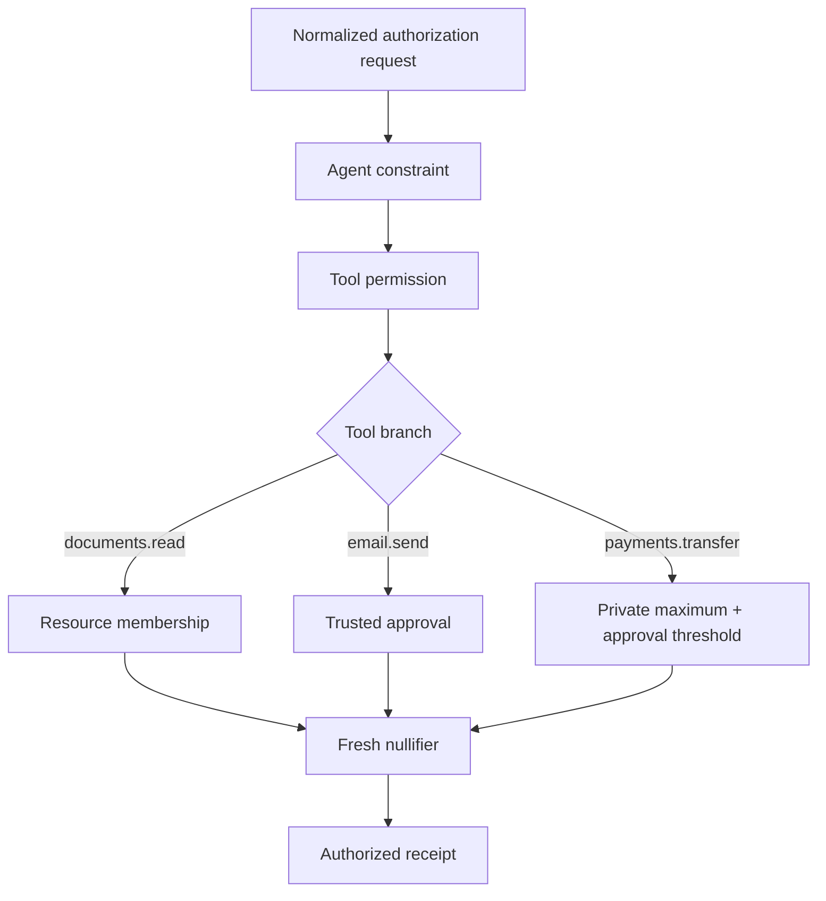

zkMCP policies answer one question:

> Given a concrete normalized action request, does this agent have authority to execute it under the private policy committed for this deployment?

The hackathon implementation intentionally uses a **small explicit policy model** rather than pretending a general policy DSL already exists.

## Current policy state

The private policy contains:

```text
policy secret
allowed agent
allowed documents tool
allowed email tool
allowed payments tool
allowed resource
private payment hard maximum
private payment approval threshold
```

These values are committed together at deployment. Later authorization calls must prove that the witness policy hashes to the same public `policyCommitment`.

## Implemented primitives

| Primitive | Current use | Private input/state |
| --- | --- | --- |
| agent identity | every protected action | allowed agent digest |
| tool permission | every protected action | committed tool digests |
| resource membership | `documents.read` | allowed resource digest |
| numeric hard maximum | `payments.transfer` | `maxPaymentAmount` |
| approval threshold | `payments.transfer` | `paymentApprovalThreshold` |
| trusted approval | email + higher-value payment | request `approved` boolean derived by gateway |
| replay protection | every successful action | private nonce + policy secret → public nullifier |

The primitives are conjoined. A successful receipt means **all constraints relevant to that branch passed**, not that an independent advisory check returned “looks okay.”



## Policy is separate from application payload

The policy does not automatically cover every field an MCP tool accepts.

For example, the payment tool forwards:

```text
amount
recipient
memo
```

but the current payment circuit constrains only:

```text
amount
approved
agent
tool
```

The recipient and memo are therefore **not** protected by the current proof statement.

This is why tool normalization and circuit design have to be reviewed together. If an application field matters to authority, it must become part of the deterministic authorization statement and, when appropriate, the execution commitment.

## Policy privacy

The current policy values are local/private witness state. The public contract stores a salted commitment rather than the raw rules.

A verifier can learn:

```text
this authorization matched policy commitment 0x...
```

without learning:

```text
the private maximum was £5,000
the assigned matter was matter:thompson
the approval threshold was £4,000
```

The local policy owner/prover obviously knows its own rules. The privacy boundary is between that private authorization environment and public verification state.

## Current lifecycle limitation

One private policy commitment is sealed per current contract deployment.

The prototype does not yet provide:

```text
policy update
policy version selection
policy revocation
multiple active policies
per-agent policy lookup
policy expiry
```

Those need an explicit lifecycle because changing a hidden policy while retaining the same public identity would weaken auditability.

## Read by primitive

<Cards>
  <Card title="Resource membership" href="/docs/policies/resource-membership">
    Restrict an agent to a private matter, project, repository, tenant, or other resource scope.
  </Card>
  <Card title="Private numeric limits" href="/docs/policies/numeric-limits">
    Prove an amount is within hidden hard and approval thresholds without publishing the thresholds.
  </Card>
  <Card title="Human approval" href="/docs/policies/human-approval">
    Resolve privileged approval outside model-controlled arguments and feed only the verified result into Compact.
  </Card>
  <Card title="Combining constraints" href="/docs/policies/combining-constraints">
    Understand why one successful proof represents the conjunction of the relevant authorization rules.
  </Card>
</Cards>

For exact circuit syntax and current field coverage, see [Circuit constraints](/docs/midnight/circuit-constraints).
