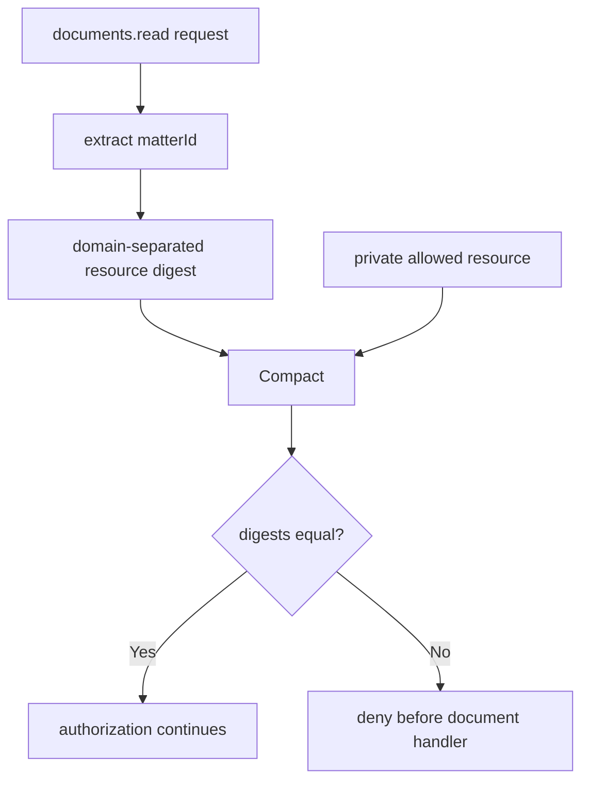

Resource membership is the simplest example of **coarse access vs fine-grained authority**.

An agent may legitimately need access to a document MCP server while still being restricted to one assigned matter.

The current legal demo models that boundary with `documents.read`.

## Gateway mapping

The upstream tool accepts application arguments such as:

```json
{
  "matterId": "matter:thompson",
  "documentId": "settlement-offer.pdf"
}
```

The normalizer extracts only the resource fact used by the policy:

```ts
{
  agent: "LegalAgent",
  tool: "documents.read",
  resource: "matter:thompson"
}
```

The original `documentId` remains in `forwardArguments` and reaches the upstream tool only after authorization.

## Fixed-width resource identity

The textual resource identifier is converted before entering Compact:

```text
SHA-256("zkmcp:id:v1\0" || "matter:thompson")
```

The private policy contains the digest of the allowed resource.

The document branch proves:

```text
requestResource == policy.allowedResource
```



## Example outcomes

Private policy:

```text
allowedResource = matter:thompson
```

| Requested matter | Result |
| --- | --- |
| `matter:thompson` | authorized |
| `matter:unrelated-client` | denied |

The public denial does not reveal the committed matter identifier or return “wrong matter.” It is surfaced as the generic private-policy denial.

## What stays private

The public authorization receipt does not contain the raw:

```text
matter identifier
allowed matter
document identifier
agent identity
```

A successful receipt instead exposes the policy/execution commitments and transaction evidence.

## Current coverage boundary

The current circuit constrains the **matter/resource**, not the exact document.

This distinction is important.

For:

```json
{
  "matterId": "matter:thompson",
  "documentId": "some-other-document.pdf"
}
```

zkMCP currently proves only that `matter:thompson` is the authorized resource. Whether `some-other-document.pdf` is valid inside that matter is left to the upstream server.

If exact document authority matters, the policy statement needs to include it.

## Stronger resource policies

The same primitive can evolve beyond one equality check.

### Multiple allowed resources

A policy may authorize membership in a private set:

```text
requestedResource ∈ allowedResources
```

Possible circuit representations include a bounded private set or a commitment/Merkle membership scheme, depending on policy size and update requirements.

### Hierarchical resources

Infrastructure tools often use hierarchy:

```text
organization
  └── project
      └── repository
          └── environment
```

A policy can prove a request belongs to an allowed parent scope without publishing every member.

### Attribute-based resource classes

Instead of exact IDs, authorization may depend on a class:

```text
dataClassification <= agentClearance
repositoryOwner == organization
matterOffice == assignedOffice
environment != production OR approved
```

Those become additional deterministic facts in the authorization envelope.

## Good use cases

Resource membership is useful for:

- legal matters and clients;
- Git repositories/projects;
- cloud accounts or environments;
- database tenants;
- internal departments;
- private datasets;
- support/customer accounts;
- folders or document collections.

The common pattern is the same: **the agent can reach the service, but the proof constrains which resource instance it has authority over.**
