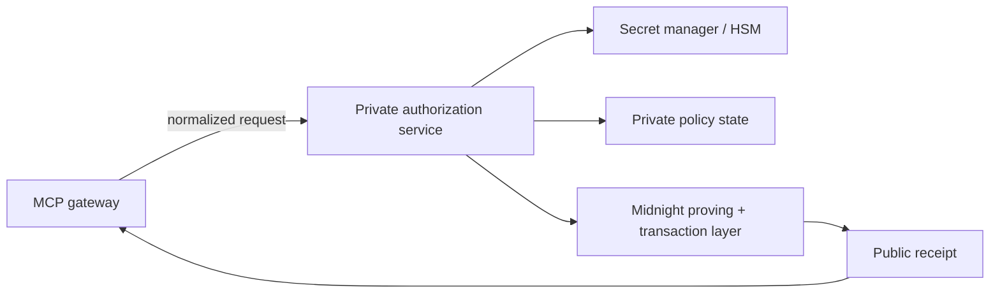

The privacy guarantee depends on more than the Compact circuit. The gateway/prover process must also protect the secrets it uses to construct private witness state and sign transactions.

## Sensitive local values

The current implementation treats the following as secret or private operational state:

```text
policy secret
allowed policy identifiers
private numeric thresholds
wallet seed / mnemonic material
private keys / shielded key material
private-state encryption password
approval token
raw authorization nonce
raw tool arguments
prompt / model context
```

Not all of these values are equally sensitive, but none should be emitted casually into logs or public receipts.

## Policy file

The local demo policy is persisted at:

```text
packages/midnight/.zkmcp-policy.json
```

The writer uses file mode:

```text
0600
```

and the file is gitignored.

The file contains the private policy secret, digested allowed identifiers, and numeric constraints. It is suitable for a local hackathon prototype, not a production secret store.

## Private state storage

Midnight private state is backed by a LevelDB provider. The storage password comes from:

```text
PRIVATE_STATE_PASSWORD
```

The prototype has a development fallback password so the local stack can run with one command.

Production deployments should make the password mandatory and source it from a secret manager or workload identity boundary.

## Wallet state

Wallet seed/key material must never cross the MCP result or application observability boundary.

The authorization client exposes only public transaction/receipt information to the gateway:

```text
transaction ID
block height
contract address
network
commitments
nullifier
```

The gateway does not need wallet secrets to route a tool call.

## Approval credentials

The current fixed demo approval token is intentionally not production-grade.

A production capability should be:

- signed or otherwise unforgeable;
- scoped to the intended action/context;
- expiring;
- replay-resistant;
- attributable to an approver identity;
- independently verifiable by the gateway.

It should also remain excluded from normal logs.

## Logging allowlist

zkMCP's evlog helper is structured as an allowlist rather than “log everything, redact later.”

Safe authorization fields include:

```text
policyCommitment
executionCommitment
nullifier
transactionId
blockHeight
contractAddress
network
proofDurationMs
result
stage
```

Fields such as the following are explicitly treated as private:

```text
policySecret
seed
mnemonic
privateKey
witness
privateState
prompt
toolArguments
authorizationContext
amount
maxAmount
approvalThreshold
nonce
password
token
```

This matters because a zero-knowledge protocol can still lose privacy if the application logs the witness inputs before proving them.

## Recommended production boundary

A hardened deployment should separate concerns roughly like this:



The gateway should receive only the policy/authorization result material it needs to make the execution decision.

## Rotation and revocation

Protecting a secret is not enough if it can never be changed.

The current policy commitment is immutable per deployment, so the prototype lacks a complete policy rotation/revocation lifecycle.

A production design needs explicit semantics for:

```text
create policy
activate policy
rotate secret or rules
revoke policy
deactivate delegated approvals
retain historical receipt verifiability
```

Those lifecycle operations should themselves be auditable and should never permit a silent policy substitution underneath an existing commitment.

## Operational checklist

Before treating zkMCP as production infrastructure:

- remove development fallback passwords;
- move policy/wallet secrets into managed secret storage;
- authenticate gateway-to-authorizer traffic;
- replace fixed approval tokens with signed scoped capabilities;
- define policy rotation/revocation;
- restrict filesystem permissions and backup access;
- verify crash dumps/APM do not collect private inputs;
- retain the current privacy-safe logging policy;
- isolate the upstream MCP server so the gateway cannot be bypassed.
