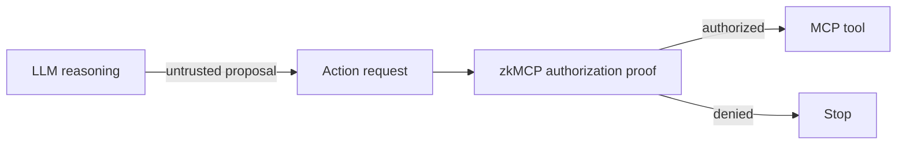

zkMCP does **not** try to prove arbitrary LLM inference. The model remains a probabilistic system that proposes actions.

## It does prove

For an authorization transaction accepted by the current Compact contract, the proof establishes that the private request satisfied the authorization constraints associated with the policy commitment pinned at deployment.

Conceptually:

```text
private policy hashes to committed policy
AND agent constraint passes
AND tool constraint passes
AND resource constraint passes when applicable
AND numeric constraints pass when applicable
AND approval requirement passes when applicable
AND authorization nonce has not been replayed
```

A successful receipt is therefore evidence for the **deterministic action boundary**.

## It does not prove

zkMCP does not prove:

- that the LLM reasoned correctly
- that its prompt was safe or trustworthy
- that a proposed action was useful
- that upstream tool implementation is honest
- that off-chain data returned by a tool is factually correct
- that the current fixed-token approval adapter is a production-grade identity system



The point is not to make the model deterministic. The point is to make the authority boundary independently verifiable.
